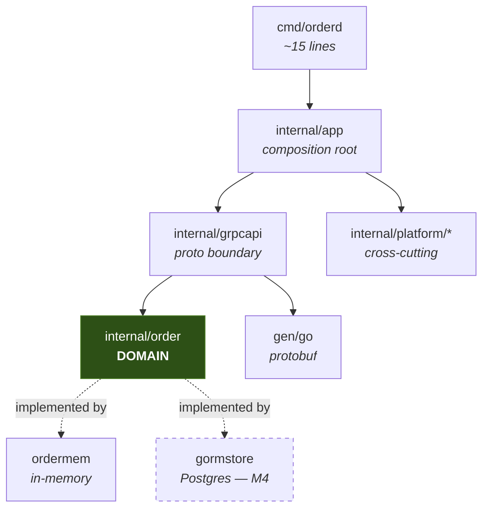

# Go gRPC Microservices Boilerplate

A production-shaped starting point for gRPC services in Go — where every architectural
decision is written down with its trade-off, and **proven by a test rather than a claim in
a README**.

Clone it, run one command, and you have a working service. No `make`, no `protoc`, no
`buf`, no Docker, no C compiler.

```bash
git clone git@github.com:pongsakorn-dev/boilerplate-go-grpc-microservices.git
cd boilerplate-go-grpc-microservices
go test ./...         # the whole default test tier -- no Docker, no protoc, no make
go run ./cmd/orderd   # gRPC on :50051, admin on :9090
```

---

## Status

This template is being built milestone by milestone. **What is here works and is tested;
what is not here is listed as not here.** A boilerplate that overstates itself wastes more
time than one that ships less.

| Area | Status | Notes |
|---|---|---|
| Proto toolchain (buf, no protoc) | ✅ Done | Codegen works offline, on Windows, with only Go installed |
| Domain layer (`internal/order`) | ✅ Done | Money, status machine, keyset pagination, shared store contract |
| gRPC transport + health + reflection | ✅ Done | Hardened server options, graceful drain |
| In-memory store (`STORE_DRIVER=memory`) | ✅ Done | Same contract the Postgres adapter will satisfy |
| Error model (`apperr`) | ✅ Done | One `Kind → gRPC code → HTTP status` table |
| bufconn test harness | ✅ Done | Tests drive the **production** server |
| LICENSE, SECURITY.md, third-party attribution | ✅ Done | Apache-2.0; `proto/third_party/` carries its own LICENSE + provenance |
| Repo/import/toolchain guard tests | ✅ Done | CRLF, import boundaries, build-tag tiers, tool pins, Taskfile portability |
| CI (Linux + Windows), golangci-lint | ✅ Done | Lint is at 0 issues; `-race` runs on Linux |
| Full interceptor chain | ✅ Done | recovery, metrics, logging, errmap, admission, auth, deadline, validation |
| Observability: slog + Prometheus + OTel traces | ✅ Done | Trace-correlated logs, `/metrics`, private pprof, OTLP export |
| Real auth (OIDC/JWKS) + default-deny policy | ✅ Done | Hostile-issuer suite, key rotation, revocation, default-deny policy the server refuses to boot without |
| Keycloak realm example | ⚠️ Partial | Structurally tested, **never booted against a real Keycloak** — see [`deploy/keycloak/`](deploy/keycloak/) |
| Postgres via GORM + goose migrations | ✅ Done | Same store contract as the in-memory driver, plus N+1, query-plan and rollback guards |
| REST/JSON edge (grpc-gateway) | ✅ Done | Client mode over an in-process connection, so REST runs the **same** interceptors |
| Distributed rate limiting (Redis) | ✅ Done | GCRA per tenant+method, **fails open**. Cache-aside deliberately cut |
| Outbox + relay | ✅ Done | Written in the business transaction; drained by `cmd/worker`. **At-least-once** |
| NATS JetStream + worker | ⬜ M8b | Deliberately **after** M10, so the deploy story exists first |
| Typed client + deadline budget | ⬜ M9 | Scope **reduced**: the second service was cut |
| Dockerfile, compose, kustomize, e2e | ⬜ M10 | Also where the Keycloak realm finally gets booted |
| `cmd/rename`, ADRs, `DELETING.md` | ⬜ M11 | Scope **reduced**: `cmd/scaffold` was cut |

> [!NOTE]
> **`AUTH_MODE=dev` is still the default, and it authenticates nobody.** That is what makes
> `git clone && go run ./cmd/orderd` work with no identity provider. It is refused when
> `APP_ENV=production`, it logs a warning on every startup, and `AUTH_MODE=oidc` is now a
> real JWT/JWKS verifier rather than a value that quietly did nothing. See
> [Authentication](#authentication) and [SECURITY.md](SECURITY.md).

---

## Quickstart

**Requirements:** Go 1.26+. That is the entire list.

```bash
go test ./...
```

That is the whole default tier. It passes with the Docker daemon stopped, no network once
the module cache is warm, and no C compiler.

### The task runner

Richer targets live in [`Taskfile.yml`](Taskfile.yml). go-task is deliberately **not** a
`go.mod` tool dependency. It declares requirements on grpc, protobuf and `x/net`, so it
would participate in module version selection for the runtime your service ships — the exact
pattern `test/toolpins_test.go` bans buf for. Removing it took `go.sum` from **352 modules to
114** and `go.mod` from **129 indirect requirements to 26**. Invoke it the way buf and
golangci-lint are:

```bash
go run github.com/go-task/task/v3/cmd/task@v3.52.0 --list-all
```

The rest of this README abbreviates that as `task`. Alias it, or just read `Taskfile.yml` —
every target is one or two plain `go` commands.

```bash
go run ./cmd/orderd
```

Boots with an in-memory store seeded with three orders, so the first call returns data
instead of an empty page.

| Listener | Address | Purpose |
|---|---|---|
| gRPC | `:50051` | The API. Reflection and `grpc.health.v1` are registered |
| Admin | `127.0.0.1:9090` | `/healthz`, `/metrics`, `/debug/pprof`. **Bound privately on purpose** |
| Gateway | — | REST/JSON arrives in M6, along with its `GATEWAY_ADDR` setting |

Poke it (install [grpcurl](https://github.com/fullstorydev/grpcurl) first — reflection means
you need no `.proto` file):

```bash
grpcurl -plaintext localhost:50051 list
```

```bash
grpcurl -plaintext -d '{}' localhost:50051 order.v1.OrderService/ListOrders
```

Other tasks — run `go tool task` to see them all:

| Command | What it does |
|---|---|
| `task gen` | Regenerate protobuf code (no protoc needed) |
| `task proto:lint` | Lint `.proto` files |
| `task doctor` | Report what this machine can run, and why it can't run the rest |
| `task test:race` | Race detector, or a clear explanation if cgo is unavailable |
| `task lint` | golangci-lint v2 |

---

## Why this template

Most Go microservice templates fail in one of two directions: they are a toy that ignores
everything hard, or they are a framework so abstracted that nobody can read them. This one
optimises for two properties instead.

**1. A stranger gets green on an unknown machine.** `git clone` → `go test ./...` passes
with nothing installed but Go. No protoc (buf compiles protos in pure Go), no make (Windows
has none), no Docker for the default tier, no cgo.

**2. Every decision has a test that fails when it is violated.** A comment saying "the
domain must not import gRPC" is a wish. A test that walks the import graph and fails the
build is a guarantee. Examples already in the tree:

| Guarantee | Enforced by |
|---|---|
| Money never touches floating point | `money_test.go` walks the AST and fails on `float64` |
| The in-memory store behaves like the real database | One contract suite runs against both |
| The order and its event commit together or not at all | Contract asserts a rolled-back tx leaves neither |
| A cross-tenant read is indistinguishable from a miss | Contract asserts `ErrNotFound`, never `PermissionDenied` |
| The documented first-run experience actually works | `test/quickstart_test.go` executes it |

---

## Repository layout

```
proto/                      .proto sources
  order/v1/order.proto      the example domain
  third_party/              VENDORED deps -> codegen works offline
gen/go/                     generated code, committed. Never hand-edited.
gen/openapiv2/              OpenAPI v2 for the REST edge, generated from the same protos

cmd/
  orderd/                   the service. ~15 lines; everything lives in internal/app
  migrate/                  goose runner. The ONLY thing that changes the schema
  worker/                   drains the outbox. A separate process on purpose
  devtool/                  cross-platform task helpers (Taskfile can't do filesystem work)

internal/
  order/                    DOMAIN. Imports no gen/, no driver, no gRPC, no telemetry
    ordermem/                 in-memory store — also backs STORE_DRIVER=memory
    orderpg/                  Postgres adapter. *gorm.DB never leaves here
    ordertest/                builders + the shared store contract
  grpcapi/                  THE proto boundary. convert / errmap / server / chain / policy
  gateway/                  REST edge. Transcodes onto the SAME gRPC service, client mode
  app/                      composition root: New, Run, Close, shutdown sequencer
  platform/                 cross-cutting, service-agnostic
    config/                   the ONLY package that reads the environment
    apperr/                   Kind enum + the one Kind->code->HTTP table
    auth/                     Verifier (dev|oidc), JWKS cache, claim mapping, Policy
      testjwks/                 in-process HOSTILE issuer: alg:none, oct keys, rotation
    interceptor/              recovery, logging, errmap, admission, auth, deadline, validate
    gormx/                    tenant guard, pool config, slog adapter, query counter
    migrations/               goose .sql via embed.FS
    outbox/                   the relay: FOR UPDATE SKIP LOCKED, batched, at-least-once
    ratelimit/                GCRA quota over Redis. Tested against miniredis, no Docker
    testdb/                   testcontainers harness (build tag `integration` only)
    observability/            slog+TraceHandler, Prometheus, OTel traces, admin mux
  testutil/                 bufconn harness that boots the real server

deploy/
  keycloak/                 worked OIDC realm: audience mapper, two principal shapes

test/                       ALL cross-cutting guards, incl. proto toolchain and Taskfile
```

---

## Architecture

Three layers and one rule: **dependencies point inward, and the domain points at nothing.**



`internal/order` imports only the standard library and `google/uuid`. It has never heard of
protobuf, gRPC, GORM, or OpenTelemetry.

**Why this is worth the mapping code in `convert.go`:** it means a proto field rename is a
change to one file instead of a database migration, and it means the business tests run in
milliseconds with no Docker. Once `*pb.Order` reaches your SQL layer, undoing that is a
simultaneous rewrite of every layer — this is the one boundary that is expensive to add
later and cheap to keep from day one.

The domain defines **ports**; adapters implement them:

```go
type Store interface {
    Create(ctx context.Context, o Order) error
    Get(ctx context.Context, tenantID, orderID string) (Order, error)
    List(ctx context.Context, tenantID string, f ListFilter) (Page, error)
    Update(ctx context.Context, o Order) error
}

// The callback receives the DOMAIN interfaces, never *gorm.DB.
// The publisher is passed alongside the store because the outbox row MUST be
// written by the same transaction as the business change.
type Atomic interface {
    InTx(ctx context.Context, fn func(Store, EventPublisher) error) error
}
```

Hand a driver type to that callback instead and three things break at once: the domain has
to import the driver, the in-memory fake can no longer implement it, and every transactional
business test silently becomes a Docker test.

### Request path

```
client
  -> recovery      panic containment
  -> metrics       counts shed load too, so it sits outside admission
  -> logging       observes the FINAL code, because errmap is below it
  -> errmap        domain error -> gRPC status + google.rpc details
  -> admission     concurrency limit, BEFORE auth
  -> auth          establishes the principal
  -> deadline      bounds the handler and everything downstream
  -> validate      protovalidate, from rules declared in the .proto
  -> OrderServer -> order.Service -> Store
```

**`errmap` is not innermost, and that placement is the subtle one.** "Innermost" is the
intuitive choice and it is wrong: an interceptor only maps errors from what it *wraps*.
Placed last it wraps the handler alone, so rejections from admission, auth and validation
sail past it unmapped and reach the client as `codes.Unknown` — and those are the errors
clients hit most often.

The real requirement is two-sided: below logging and metrics (so they record the mapped
code), and above every interceptor that produces an error (so those get mapped at all).
`internal/grpcapi/chain_test.go` caught this by asserting outcomes rather than reading the
list.

---

## Testing

Tiers are separated by **build tags, never `testing.Short()`**. A `Short()` skip still links
testcontainers into every test binary; a build tag makes the default tier's dependency set a
compile-time guarantee. That is the only way `go test ./...` is safe with Docker stopped.

| Tier | Command | Infra | Measured on this machine |
|---|---|---|---|
| Default | `go test ./...` | none | **9s** cold cache, **1s** cached |
| Codegen | `task verify:codegen` | network | **17.6s** — regenerates and byte-compares |
| Integration | `task verify:int` | Docker | **20s** with the image cached. **Skips**, never fails, without Docker |
| End-to-end *(M10)* | not yet — arrives with the compose stack | Docker + compose | — |

### Guard tests

`test/` holds tests that assert nothing about business behaviour — they exist to
stop the template rotting. Each has been verified to actually **fail** when violated, not
merely to pass today:

| Guard | Catches |
|---|---|
| `TestNoCRLFInTrackedFiles` | Line endings that would break codegen diffs and golden files |
| `TestDomainImportsNothingHeavy` | The domain reaching for gRPC, GORM, protobuf, OTel |
| `TestPlatformDoesNotImportServices` | `platform/` becoming order-service helpers |
| `TestOnlyConfigReadsTheEnvironment` | A stray `os.Getenv` three layers down |
| `TestBannedToolsAreNotToolDependencies` | buf/golangci-lint entering the `tool` directive |
| `TestBufVersionIsConsistent` | The three buf pins drifting apart |
| `TestNoForbiddenShellCommands` | A Taskfile line that only works on Unix |
| `TestFilePathsAreQuoted` | Unquoted paths breaking on `C:\Program Files\...` |
| `TestDefaultTierNeedsNoDocker` | Docker deps leaking into the default tier |
| `TestTaggedTestsHaveAValidConstraint` | A `//go:build` missing its blank line, silently ignored |
| `TestSynctestIsNotUsedWithRealNetworking` | A synctest bubble that would hang forever |
| `TestGeneratedCodeIsUpToDate` | Committed `gen/` drifting from the `.proto` |
| `TestAllProtoFieldsAreAcknowledged` | A new proto field silently never mapped |
| `TestEveryKindIsMapped` | A new error Kind with no gRPC/HTTP row |
| `TestInternalErrorsNeverLeakAndNeverLose` | Driver text reaching a client, or vanishing from the log |
| `TestSecretIsRedactedThroughEveryEscapeRoute` | A password escaping via fmt, JSON **or** slog |
| `TestValidateRejectsDevAuthInProduction` | `AUTH_MODE=dev` reaching production |
| `TestTraceHandlerPassesTheStdlibConformanceSuite` | A wrapping slog handler breaking `WithGroup` |
| `TestTraceHandlerSurvivesWith` | Derived loggers silently losing trace correlation |
| `TestPprofIsOnDefaultServeMuxButWeNeverServeIt` | Profiling endpoints on a public listener |
| `TestAdmissionReleasesSlotOnPanic` | A panicking handler permanently consuming a slot |
| `TestCommentsDoNotCiteMissingTests` | A comment claiming a proof that does not exist |
| `TestVendoredProtosKeepTheirLicenseHeaders` | Apache-2.0 attribution being stripped from vendored protos |
| `TestRootLicenseNamesItsCopyrightHolder` | The root LICENSE losing its copyright holder to a rename substitution |
| `TestTaskTargetsReferenceRealPaths` | A task target pointing at a file that does not exist |
| `TestBannedToolsAreNotToolDependencies` | A build tool entering the production module graph |
| `TestErrorsAreMappedBeforeLoggingObservesThem` | Interceptor order regressing to `codes.Unknown` |
| `TestRecoveryThroughTheRealChain` | A recovered panic leaking its raw value to the client |
| `TestPolicyCoversEveryDeclaredRPC` | An RPC shipping with no authorisation decision |
| `TestPolicyRulesAllReferenceRealMethods` | A rule left behind by a rename, protecting nothing |
| `TestReadAndWriteScopesAreActuallySeparated` | A read-only credential able to mutate |
| `TestVerifyRejectsHostileTokens` | `alg:none`, wrong `aud`, missing `exp`, unknown `kid` |
| `TestKeyAlgorithmBindingIsEnforced` | An algorithm substitution within one key type |
| `TestRevokedKeysStopBeingTrusted` | A revoked signing key trusted until the pod restarts |
| `TestSlowRefreshDoesNotStallCachedVerifications` | One unauthenticated request stalling all auth |
| `TestDiscoveryRecoversAfterAFailedFirstAttempt` | A pod serving Unauthenticated forever after an IdP blip |
| `TestRealmSetsTheAudienceOnEveryTokenIssuingClient` | The Keycloak realm losing its audience mapper |
| `TestStatusRoundTripsThroughItsName` | Stored status names drifting from the Go constants |
| `TestTenantScopedOfUnwrapsEveryShapeGORMProduces` | The tenant guard silently not applying to `Find(&[]T{})` |
| `TestTenantGuardFailsClosed` | A query with no tenant returning **every tenant's rows** |
| `TestListDoesNotNPlusOne` | 50 orders costing 51 queries instead of 2 |
| `TestKeysetPaginationSeeksRatherThanFilters` | A rewrite that keeps the index but loses the seek |
| `TestMigrationsRoundTrip` | A `down` block that does not work, discovered mid-release |
| `TestRESTGoesThroughTheInterceptorChain` | The REST edge bypassing auth, authz, limits and error mapping |
| `TestUnknownJSONFieldsAreRejected` | A client typo silently becoming an empty field |
| `TestOpenAPIFieldNamesMatchWhatTheServerEmits` | A published schema that disagrees with the running service |
| `TestReadmeDocumentsEveryPackage` | A package on disk and nowhere in these docs |
| `TestRateLimitIsACTUALLYWIREDINTOTheChain` | A correct limiter that the server never calls |
| `TestLimiterFailsOPENWhenRedisIsDown` | A dead quota store taking the whole service down |
| `TestRejectionDoesNotExtendThePenalty` | A retrying client extending its own lockout indefinitely |
| `TestKeysAreIndependent` | One noisy tenant throttling everybody |
| `TestConcurrentRelaysDoNotBlockOnEachOther` | A second relay that waits instead of helping |
| `TestAFailedPublishAbandonsTheWholeBatch` | A half-marked batch losing events on broker failure |

### The pattern worth stealing: one contract, two implementations

`ordertest.RunStoreContract` is a single suite of 15 behaviours. It runs unchanged against
the in-memory store (microseconds, no Docker) and — from M4 — against real Postgres in
testcontainers.

That is what makes the fast tier *trustworthy*. When a business test uses the in-memory
store and passes, it passes against behaviour real Postgres has also been shown to have. A
hand-written fake that nothing holds to a contract is just a second implementation of your
bugs — and unlike a generated mock, a fake can be *proven* equivalent to the real thing.

Assertions only Postgres can make (SQLSTATE mapping, `FOR UPDATE SKIP LOCKED` disjointness,
index usage) live in the adapter's own test file, not in the shared contract.

---

## Key decisions

Each links to where it lives. The full trade-off analysis for every one of these is in the
implementation plan; the short version:

| Decision | Choice | Why not the alternative |
|---|---|---|
| Transport | grpc-go + grpc-gateway | Connect-RPC's one-port win evaporates once pprof/metrics need a private listener, and it invalidates the entire go-grpc-middleware / otelgrpc / bufconn ecosystem |
| Proto codegen | [buf](buf.gen.yaml) via `go run …@v1.72.0` | **Never** the `tool` directive — buf's own docs forbid it, since MVS would silently move your protobuf *runtime* to satisfy a build tool |
| Codegen plugins | [`tool` directive](go.mod) | Here it is exactly right: sharing a module graph with `google.golang.org/protobuf` makes generator/runtime skew structurally impossible |
| Third-party protos | [vendored](proto/third_party/) | BSR deps resolve into a cache `go mod download` never warms, which would make "generate offline" false |
| Domain boundary | [mapping layer](internal/grpcapi/convert.go) | Passing `*pb.Order` to storage makes a field rename a migration |
| Money | [integer units + nanos](internal/order/money.go) | `float64` cannot represent `0.10`; the drift reconciles fine in tests and wrongly at month end |
| IDs | UUIDv7 | v4 is uniformly random, so every insert lands in a random B-tree page. Trade-off: v7 leaks creation time |
| Pagination | [keyset](internal/order/cursor.go) | `OFFSET` skips and repeats rows when data changes mid-page. Retrofitting keyset is a breaking API change **plus** an index change |
| Wiring | [manual constructors](internal/app/app.go) | A missing dependency is a compile error, not a runtime one. Adding fx/wire later is additive; removing either is a rewrite. `google/wire` is archived |
| Time in tests | `testing/synctest` | No `Clock` interface — the stdlib made that abstraction unnecessary in Go 1.25 |
| Assertions | stdlib + `go-cmp`/`protocmp` | One assertion idiom, not two. Adding testify later is purely additive |
| Task runner | [Taskfile](Taskfile.yml) via `go tool` | No Makefile: Windows has no `make`. Task's shell has no `rm`/`sed`/`jq` either, so those live in `cmd/devtool` |

---

## The outbox

The domain writes an event row **inside the same transaction** as the business change, so
*"the order committed but the event vanished"* is not a state the database can hold. A
separate process drains it:

```bash
go run ./cmd/worker
```

### What it guarantees, precisely

| | |
|---|---|
| ✅ **No lost events** | The row and the business change commit together, or neither does |
| ✅ **At-least-once** | Every event reaches the broker at least once |
| ❌ **Not exactly-once** | If the broker accepts a publish and the marking transaction then fails, the event is republished. **Consumers must deduplicate** |
| ❌ **Not globally ordered** | Two relays claim disjoint batches concurrently, so event 20 can arrive before 19 |
| ⚠️ **Per-aggregate order** | Holds only with a **single** relay. Two can split one order's events and finish out of order |

Anyone claiming exactly-once delivery has moved the deduplication somewhere you haven't
looked yet. Those last two are the ones that bite, so they're written down rather than
discovered.

### `FOR UPDATE SKIP LOCKED` — measured, not assumed

The claim query is what makes running more than one relay useful. Against Postgres 17, with
one transaction holding rows 1–10 and a second issuing the identical claim under a 400ms
`lock_timeout`:

| | Second transaction |
|---|---|
| `FOR UPDATE` | **Blocks**, then dies: `canceling statement due to lock timeout (SQLSTATE 55P03)` at 403ms |
| `FOR UPDATE SKIP LOCKED` | Returns rows 11–20 in **1ms** |

The difference is invisible in the *results* — both eventually publish every row exactly
once. Only the **blocking** distinguishes them, which is why
`TestConcurrentRelaysDoNotBlockOnEachOther` asserts that both relays reach `Publish`
concurrently rather than asserting on what they published.

That test took two attempts. The first gave each relay a batch big enough for the whole table
and checked no row shipped twice — it passed while proving nothing, because one relay claimed
everything and the other claimed none, which is the identical outcome with or without
`SKIP LOCKED`.

### The transaction is held across the publish

Deliberate, and a real trade-off. Holding it is what makes failure safe: if the broker rejects
a message or the process dies mid-batch, the transaction rolls back, `published_at` stays
`NULL`, and the next drain reclaims the rows. Nothing is lost and no reconciliation job is
needed.

The cost is a database transaction open for the duration of the batch's network I/O, which
bloats vacuum and inflates replication lag if the batch is large or the broker slow. Hence
`OUTBOX_BATCH_SIZE`. A fork under real load should switch to a **lease** — claim with a short
`UPDATE` stamping `claimed_at`, commit, publish outside any transaction, then mark published —
which needs lease expiry to recover from a crashed relay, exactly the complexity this version
avoids while the volume doesn't demand it.

A partial failure abandons the **whole** batch. Marking the successful ones would need a second
transaction and leaves the batch half-committed if that fails too. Rolling back republishes a
few messages the broker already took — a duplicate the at-least-once contract already requires
consumers to handle. Trading a duplicate for a lost event is never the right way round.

### Why a separate process

Running the relay inside `orderd` ties publishing throughput to however many API replicas the
HPA happens to have chosen: a traffic lull that scales the API down also slows event delivery,
and scaling up for latency multiplies the relay's database load for nothing. Different
bottlenecks, different replica counts — and a relay stuck on an unavailable broker shouldn't
consume resources in the process serving customers.

> [!NOTE]
> The publisher is currently `outbox.LogPublisher`, a **placeholder** that logs instead of
> sending. M8b replaces that one line with NATS JetStream. Everything else — claiming,
> batching, the marking transaction, at-least-once semantics — is already the real thing and
> none of it changes when the broker arrives.

---

## Rate limiting

`REDIS_ADDR` enables a per-tenant quota shared by every replica. Empty disables it, and the
service runs unthrottled — a supported configuration for a single replica, or when limits are
applied at the ingress.

### It is not the admission limiter

Two mechanisms, two positions in the chain, two jobs:

| | Admission | Rate limit |
|---|---|---|
| Scope | **Local** to one process | **Distributed** across replicas |
| Bounds | Concurrency, sized from the DB pool | Requests per tenant per method |
| Position | **Before** auth | **After** auth |
| Protects | The process from work it can't execute | A business policy — "this customer bought 600/min" |

Admission runs first so a flood is shed *without paying for signature verification*. The rate
limiter runs after auth because its key is the tenant, and the tenant comes from the verified
token — before auth the only available key is client-controlled, which is not a quota but a
suggestion.

Shipping only the local one is the common mistake: a per-replica limit set at "100rps"
silently becomes 100 × replicas, resets on every deploy, and changes meaning every time the
HPA scales.

### GCRA, not a token bucket

A token bucket needs two values per key (tokens, last refill) read-modify-written atomically.
[GCRA](internal/platform/ratelimit/gcra.go) needs **one**: the theoretical arrival time of the
next permitted request. One value fits in a short Lua script with no cross-replica race — and
it answers *"when may I retry?"* **exactly**, because the TAT is that answer.

That precision matters. A limiter that can't say when to come back leaves clients retrying
immediately, turning a throttle into a self-inflicted flood. Rejections carry `RetryInfo` on
gRPC and a `Retry-After` header on REST.

Two subtleties the tests pin down:

- **Rejected requests write nothing.** If a rejection advanced the TAT, a client retrying in a
  loop would push its own recovery further away with every attempt and could lock itself out
  indefinitely.
- **The script reads Redis's clock**, not the caller's, so replicas with skewed clocks still
  agree on the window.

### It fails OPEN — the opposite of auth

| | On failure | Why |
|---|---|---|
| Auth | **Denies** | Protects *data*. Without it a request may read what it must not |
| Rate limit | **Allows** | Protects *capacity*. Without it requests are merely unthrottled |

An unreachable Redis rejecting every request on every replica would convert "quotas are
briefly unenforced" into a total outage, making the quota store a hard dependency of serving
at all. It's loud when it happens — a WARN per request, plus grpcprom's existing counters.

Which makes the client timeouts load-bearing. go-redis defaults to a 5s dial, 3s read/write
and 3 retries, so a dead Redis adds **seconds per request** before the interceptor can fail
open — the availability protection becoming the outage. Measured across the five requests of
`TestAnUnreachableRedisDoesNotBreakTheService`: **8.5s** on defaults, **4.2s** with one retry,
**2.0s** with none. Settings are 200ms dial, 100ms read/write, no retries.

### Why no cache-aside

It was in the plan and was cut. A cache's correctness depends entirely on the invalidation
rules of the data being cached, so a *generic* one teaches a pattern that is wrong for most
domains — and it is easy to add later against the existing `order.Store` interface. Rate
limiting has no such ambiguity: the semantics are the same everywhere.

### Tested without Docker

miniredis runs the real Lua script in-process **and lets the tests move its clock**, which
matters because rate limiting is entirely about the passage of time — a limiter tested only at
`t=0` has had half its behaviour checked.

One trap worth knowing if you extend these tests: **miniredis has two independent clocks.**
`FastForward` advances key expiry but *not* `TIME`; `SetTime` does the reverse. Driving only
one produces a test that looks like it waits and doesn't — and it can pass for the wrong
reason. `TestRejectionDoesNotExtendThePenalty` first went green not because capacity had
recovered, but because `FastForward` had expired the key and handed the next request a fresh
bucket.

---

## The REST edge

`GATEWAY_ADDR` (default `:8080`) serves HTTP+JSON transcoded onto the **same** gRPC service,
using the `google.api.http` bindings already in the `.proto`. There is no second handler and
no second copy of any business rule.

```bash
curl -H "Authorization: Bearer $TOKEN" http://localhost:8080/v1/orders
```

Set `GATEWAY_ADDR=""` to switch it off entirely — a service with only gRPC clients should not
expose an HTTP surface it never uses.

### Client mode, and why it is the whole design

grpc-gateway can register two ways, and the difference is not a performance tuning knob:

| | What it does | What runs |
|---|---|---|
| **Server mode** | Calls the handler implementation directly, in-process | **Nothing.** No auth, no authz, no admission control, no error mapping, no metrics, no tracing |
| **Client mode** ← | Makes a real gRPC call | The entire interceptor chain |

Server mode is faster and needs no connection. It is also, in the registration code, one
identifier different from the safe one.

That was measured, not assumed: an anonymous `GET /v1/orders` against a server-mode mux built
from this repo's own handler returns **500** — and only because `grpcapi`'s `tenantOf` refuses
to proceed without a principal. A handler that defaulted the tenant instead, which is the more
common shape, would have returned **200 and somebody else's orders**. "Depends how defensive
each handler happens to be" is not a security model.

So the gateway dials a real connection, and
[`TestRESTGoesThroughTheInterceptorChain`](internal/gateway/gateway_test.go) sends an
unauthenticated request and requires **401** — a code only the auth interceptor produces.

### The connection is in-process

The gateway does not dial `localhost:50051`. `app.New` stands up a second listener for the
same `grpc.Server` — an in-memory `bufconn` — and the gateway dials that. Same server, same
chain, no loopback hop, no self-connection polluting connection metrics, and no address that
can be pointed at the wrong thing.

`grpc.Server.Serve` accepts any number of listeners concurrently, so this costs one goroutine.

### JSON contract

| Setting | Value | Why |
|---|---|---|
| `UseProtoNames` | on | `customer_id`, not `customerId` — one name per field across proto, gRPC, REST, SQL and OpenAPI |
| `EmitUnpopulated` | on | Zero values stay present, so a client can tell "unset" from "zero" |
| `DiscardUnknown` | **off** | A misspelled field is a `400`, not a silently empty order |

Errors use one shape, modelled on AIP-193 — a **symbolic** code, the stable `reason` clients
branch on, and the `google.rpc` details a gRPC client would receive:

```json
{"error":{"code":"NOT_FOUND","reason":"ORDER_NOT_FOUND","message":"order not found","domain":"orderd"}}
```

grpc-gateway's default body is `{"code": 5, "message": "..."}` — a numeric gRPC code,
meaningless to a client that never speaks gRPC, and no reason field at all. The HTTP status
comes from **`apperr`'s table**, the same one that produced the gRPC code, so the two surfaces
cannot drift apart about what a `NotFound` is.

### OpenAPI

`gen/openapiv2/orderd.swagger.json` is generated from the same protos and committed.

One flag in `buf.gen.yaml` is load-bearing: `json_names_for_fields=false`. The plugin defaults
to `true`, which documents lowerCamelCase while the server emits proto names — a schema that
is wrong about every multi-word field, and plausible enough that nobody notices until a
generated client fails. `TestOpenAPIFieldNamesMatchWhatTheServerEmits` compares the document
against a real response rather than against itself.

---

## Persistence

`STORE_DRIVER=memory` (default) needs nothing. `STORE_DRIVER=postgres` needs a DSN and a
schema:

```bash
go run ./cmd/migrate up
```

### The contract is the point

[`ordertest.RunStoreContract`](internal/order/ordertest/contract.go) is one suite of 15
behaviours. It runs **unchanged** against the in-memory store (microseconds, no Docker) and
against real Postgres (testcontainers). That turns *"the fake behaves like the database"* from
an assumption into a tested property — and a fake nothing holds to a contract is just a second
implementation of your bugs, which every unit test above it then agrees with.

Assertions only the real database can make live in
[`orderpg_integration_test.go`](internal/order/orderpg/orderpg_integration_test.go), not in the
contract: SQLSTATE mapping, query plans, N+1 counts, migration rollback.

### What GORM gives up, and what replaces it

GORM was chosen for reach — it is the ORM most Go teams already know. What it gives up is
compile-time column checking, so three mechanisms are load-bearing rather than nice-to-have:

| Mechanism | Replaces | Failure it catches |
|---|---|---|
| [Fail-closed tenant callback](internal/platform/gormx/tenant.go) | linting `.sql` files | A query with no tenant returns **every tenant's rows** — and looks like a working feature |
| [Query counter](internal/platform/gormx/counter.go) | nothing; N+1 is invisible | 50 orders costing 51 queries instead of 2. Identical data, identical code review |
| Plan assertions on captured SQL | `EXPLAIN` by hand, once | A rewrite that keeps the index but loses the seek |

The counter ships as **normal code**, not a test helper — a guard only the template can use
teaches nothing. Point it at your own hot paths.

### Two decisions worth knowing before you fork

**Money is two integer columns, not `numeric(19,4)`.** The domain type is
`google.type.Money`'s shape — units plus nanos (10⁻⁹). `numeric(19,4)` holds four decimal
places, so it *truncates nanos silently*, which is the exact money bug the integral type
exists to prevent. Want SQL aggregation? Add a generated `numeric(19,9)` column; keep the
exact representation authoritative.

**Status is stored as its NAME, not the iota.** Storing the number couples every row to the
declaration order of the Go constants — inserting a status in the middle, which looks
harmless, reinterprets existing rows. `order_test.go` round-trips every value through
`String`/`ParseStatus` so the two cannot drift.

### Migrations never run on boot

They run from [`cmd/migrate`](cmd/migrate/main.go) only. Booting them from the server means
every replica in a rolling deploy races on the same schema; goose serialises them with an
advisory lock, so a slow `ALTER` now stalls every pod's readiness at once and the symptom is
*"the deploy is stuck"*. It also ties rolling back the app to rolling back the schema, which
are different decisions with different risks. In Kubernetes this is a Job that completes
before the Deployment rolls.

There is no bare `down` — only `down-to <version>`. A one-keystroke rollback of the latest
migration is how a production table gets dropped by someone who meant to do it in staging.

### The integration tier

```bash
go test -tags=integration ./...
```

**A build tag, not `testing.Short()`.** A `Short()` skip still *links* testcontainers into
every test binary in the module; a build tag makes the default tier's dependency set a
compile-time property, which [`test/tiers_test.go`](test/tiers_test.go) then asserts. That is
what makes `go test ./...` safe with the Docker daemon stopped.

One container per package, started in `TestMain`, migrated once into a template database that
each test then **clones** — `CREATE DATABASE … TEMPLATE` costs tens of milliseconds, so tests
stay isolated *and* parallel. With Docker down, every test **skips** with a message naming
your active Docker context (the usual Windows cause is testcontainers resolving the default
`docker_engine` pipe while Docker Desktop publishes `desktop-linux`).

---

## Authentication

Two modes, selected by `AUTH_MODE`. The selection lives in one factory
([`auth.NewVerifier`](internal/platform/auth/verifier.go)) whose **default arm returns an
error** — never a permissive fallback, never a `nil` verifier.

That shape is not defensive styling; it is a fix for a bug this repo actually shipped. The
server once installed the dev interceptor unconditionally and never read `AUTH_MODE` at all,
so `APP_ENV=production AUTH_MODE=oidc` validated, booted clean, reported healthy, and served
every request as a full-scope `dev-tenant` principal. The bypass was confirmed by calling an
RPC with no credentials and getting three orders back. A factory that cannot say *"I do not
recognise this mode"* will fall through to whatever it can build, and what it can build is
always the permissive one.

| Mode | Verifies | Use |
|---|---|---|
| `dev` (default) | **Nothing.** Returns a fixed principal for any input, including no token at all | So a fresh clone runs with no identity provider. Refused when `APP_ENV=production`; warns on every startup |
| `oidc` | JWT signature against the issuer's JWKS, plus `iss`, `aud`, `exp`, `nbf`, `kid` | Everything else |

### What the verifier refuses

Each row is a token that verifies against *something*, which is what makes it dangerous.
All are in [`oidc_verifier_test.go`](internal/platform/auth/oidc_verifier_test.go).

| Rejected | Why it matters |
|---|---|
| `alg: none` | The original JWT vulnerability: an unsigned token |
| HS256 MAC'd with the issuer's **public** key | Algorithm confusion — the public key is published in the JWKS, so anyone can use it as an HMAC secret |
| A symmetric (`oct`) key in the JWKS | Publishing a symmetric key publishes the ability to mint tokens |
| RSA below 2048 bits | Factorable by well-resourced attackers |
| PS256 signed with a key published as RS256 | Algorithm substitution *within* a key type — the one case only our own check catches |
| Wrong `aud` | A token minted for a **different application on the same IdP** |
| No `exp` | A token with no expiry never expires |
| No tenant claim | Cryptographically perfect and useless in a multi-tenant service |
| A discovery document whose `issuer` disagrees | Stops a redirect or hijacked DNS pointing this service at a JWKS an attacker controls |

The suite runs against an **in-process issuer**
([`testjwks`](internal/platform/auth/testjwks/testjwks.go)) — no Docker, no network, no
provider. That is not only convenience: half these cases need a *hostile* issuer, and no real
provider will serve a symmetric key or go offline mid-request on request.

Key rotation, cache-hit counts, revocation and IdP outages are covered in
[`jwks_test.go`](internal/platform/auth/jwks_test.go). The outage rule is deliberately
three-way, because it is the one people get wrong in both directions: **no cached keys +
fetch fails → refuse; cached key hit + fetch fails → accept** (a signature does not become
invalid because the IdP is restarting); **unknown key + fetch fails → refuse.**

Two properties there are less obvious and were both added after an adversarial review pass
found them missing:

- **The key set has a maximum age** (`OIDC_MAX_KEY_AGE`, default 15m). Refetching only on a
  cache *miss* sounds sufficient and is not: when an issuer revokes a key it keeps signing
  with its others, so every legitimate token names a cached key, no miss ever occurs, and the
  revoked key stays trusted until the pod restarts.
- **The JWKS fetch happens with no reader lock held.** Otherwise one *unauthenticated*
  request naming an unknown key id — `kid` is read before any signature check — stalls every
  concurrent verification for the IdP's full response time, ignoring their deadlines, while
  holding admission slots.

### Authorisation is default-deny, and the server will not boot without it

[`DefaultPolicy`](internal/grpcapi/policy.go) maps every RPC to a rule. A method with no
entry is **denied** — and `NewServer` calls `Policy.ValidateCoverage` after registration, so
an uncovered method stops the process rather than waiting for someone to run the tests.

That check earned its place immediately. The policy was written from `order.proto` plus the
health methods from memory — `Check` and `Watch`. The server refused to start:
`/grpc.health.v1.Health/List` is registered by grpc-go, appears in no `.proto` here, and
would have been missed by any policy derived from the schema alone.

Coverage is asserted from two directions, because *"what does this service expose"* has two
different answers: `GetServiceInfo` knows about health and reflection but not about an RPC
that was generated and never wired up, and the descriptor registry knows the opposite. The
registry also needed filtering — it holds descriptors for everything **linked in**, and this
repo imports the OTLP exporter, so the naive version demanded an authorisation rule for the
OpenTelemetry collector.

### Providers

Nothing in `internal/platform/auth` knows what Keycloak is. Point it at any OIDC provider and
set two claim paths:

| Provider | `OIDC_TENANT_CLAIM` | `OIDC_SCOPE_CLAIM` |
|---|---|---|
| Keycloak | `tenant_id` | `scope` or `realm_access.roles` |
| Auth0 | `https://yourapp.example.com/tenant_id` | `scope` |
| Cognito | `custom:tenant_id` | `cognito:groups` |
| Entra ID | `tid` | `scp` |

A worked Keycloak realm is in [`deploy/keycloak/`](deploy/keycloak/) — including the
**audience mapper**, which is the single most common OIDC integration failure: a Keycloak
access token's default `aud` is `account`, not your API. That realm file has not yet been
booted against a real Keycloak; see the note in its README.

---

## Configuration

Everything is environment variables, read in exactly one place
([`internal/platform/config`](internal/platform/config/config.go)) and validated **before
any listener binds**. Validation reports *every* problem at once — one at a time turns a
misconfigured deploy into five rollout attempts.

| Variable | Default | Notes |
|---|---|---|
| `APP_ENV` | `development` | `development` \| `staging` \| `production` |
| `GRPC_ADDR` | `:50051` | |
| `ADMIN_ADDR` | `127.0.0.1:9090` | Keep it private — it serves pprof |
| `GATEWAY_ADDR` | `:8080` | HTTP+JSON edge. **Empty disables it** — a gRPC-only service should not expose HTTP it never uses |
| `REDIS_ADDR` | | Rate limiting. **Empty disables it** and the service runs unthrottled |
| `RATE_LIMIT_PER_MINUTE` | `600` | Sustained quota per tenant **per method** |
| `RATE_LIMIT_BURST` | `100` | Instantaneous allowance. Without burst, two back-to-back requests are rejected at any sustained rate |
| `OUTBOX_BATCH_SIZE` | `100` | Bounds one claim — and therefore how long a transaction is held across broker I/O |
| `OUTBOX_POLL_INTERVAL` | `1s` | Idle latency only. A full batch is followed immediately |
| `OUTBOX_MAX_CONNS` | `2` | The relay's pool. Small so background work doesn't eat the connection budget |
| `STORE_DRIVER` | `memory` | `memory` \| `postgres`. Postgres needs `POSTGRES_DSN` and a `migrate up` first |

Settings for subsystems that do not exist yet (Redis, NATS, the gateway) are deliberately
**absent** rather than present-and-ignored — a config field that reads as wired and is not is
the same class of problem as a proto field that validates and is then dropped.

| `AUTH_MODE` | `dev` | `dev` \| `oidc`. **Refused when `APP_ENV=production`**; an unknown value refuses to start |
| `OIDC_ISSUER_URL` | | Required for `oidc`. Discovery finds the JWKS; `http://` is refused off loopback |
| `OIDC_AUDIENCE` | | Required for `oidc`. **Never defaulted** — an empty audience accepts every token the issuer ever minted, including other applications' |
| `OIDC_TENANT_CLAIM` | `tenant_id` | Dotted paths walk nested claims (`realm_access.tenant`) |
| `OIDC_SCOPE_CLAIM` | `scope` | Accepts the space-delimited string or a JSON array |
| `OIDC_LEEWAY` | `30s` | Clock skew tolerance on `exp`/`nbf` — not a grace period |
| `OIDC_MAX_KEY_AGE` | `15m` | How long a cached JWKS is served before revalidation. This is what makes key **revocation** take effect |
| `POSTGRES_MAX_OPEN_CONNS` | `10` | Explicit on purpose: pool defaults read the *node's* CPU count, not the cgroup limit, so 20 replicas exhaust `max_connections` |
| `GRPC_MAX_CONCURRENT_STREAMS` | `250` | grpc-go's default is effectively unbounded — this is a DoS control |
| `GRPC_MAX_CONNECTION_AGE` | `30m` | Forces periodic GOAWAY so rolling deploys actually rebalance |
| `SHUTDOWN_DRAIN_DELAY` | `5s` | Health flips to NOT_SERVING, then waits. Kubernetes deregisters asynchronously, so a pod that stops instantly still gets traffic |

Licensed under [Apache-2.0](LICENSE). Secrets use a [`Secret` type](internal/platform/config/config.go) that redacts through
`String`, `MarshalJSON`, **and** `LogValue` — the three routes by which a password normally
escapes. Covering only one is the usual mistake.

---

## Toolchain notes

**No `protoc`.** buf compiles `.proto` files with a pure-Go compiler. `task gen`
works on a machine that has only Go.

**No `make`.** Windows does not ship it. [`Taskfile.yml`](Taskfile.yml) commands may invoke
only `go`, `docker`, `kubectl`, and `git`, because Task's embedded shell has no `rm`, `cp`,
`sed`, `awk`, or `jq` builtins on Windows. Anything filesystem- or text-shaped lives in
[`cmd/devtool`](cmd/devtool/main.go) in Go.

**`go test -race` will not run on stock Windows.** The race detector links the C++
ThreadSanitizer runtime, so it requires cgo and therefore a C compiler. This is a permanent
limitation, not a configuration gap. `task test:race` detects it and prints the two
real options (a container, or WinLibs + `CGO_ENABLED=1`) instead of a bare
`-race requires cgo`. CI runs `-race` on Linux.

**`.gitattributes` is the first commit in this repo's history**, before any generated file
existed. With `core.autocrlf=true` — a common Windows default — git checks out CRLF while
every generator writes LF, which silently breaks the codegen diff test, golden files, and
`gofmt` in CI, for a reason a newcomer cannot diagnose.

**Docker Desktop + testcontainers:** testcontainers resolves the daemon via
`~/.testcontainers.properties`, `DOCKER_HOST`, then the *default* named pipe — it does not
read Docker contexts. On Docker Desktop the active context is usually `desktop-linux`, so a
healthy daemon can be invisible. `task doctor` detects and explains this.

---

## Making it yours

The module path is the placeholder `github.com/example/gomicro`.

`cmd/rename` (M11) will rewrite `go.mod`, every import, `buf.gen.yaml`'s
`go_package_prefix`, and the image references in one command, then delete itself. Until it
lands, change `go.mod` and the `go_package_prefix` in [`buf.gen.yaml`](buf.gen.yaml), then
run `task gen`.

Because managed mode owns `go_package`, **no `.proto` file hard-codes an import path** —
forking is one line in `buf.gen.yaml`, not one line per proto.

### Adding an RPC

1. Add it to [`proto/order/v1/order.proto`](proto/order/v1/order.proto) with a
   `google.api.http` binding and protovalidate rules.
2. `task gen`
3. Implement the business rule in `internal/order` and add a case to the store contract if
   it touches persistence.
4. Add the thin adapter method in [`internal/grpcapi/server.go`](internal/grpcapi/server.go).
5. Add a `Rule` for it in [`internal/grpcapi/policy.go`](internal/grpcapi/policy.go).

**Step 5 is not optional, and skipping it is not a lint warning.** `NewServer` calls
`Policy.ValidateCoverage` after registration, so a server with an uncovered RPC returns an
error instead of a server — the process does not start, `app.New` fails, and every test using
the harness fails with a message naming the method and the file to edit. (Not a *compile*
error: the check is at construction, because the method set is only knowable once the server
is built.)

---

## Roadmap

**Done:** M0–M1 foundation · M2 toolchain guards · M3 interceptors + observability ·
M5 auth · M4 Postgres · M6 REST edge · M7 rate limiting · M8a outbox relay ·
plus an evidence-backed cuts pass.

**Remaining, in order:**

| | Milestone | What it delivers | Scope change |
|---|---|---|---|
| **next** | **M10** Deploy | Dockerfile, compose, kustomize, e2e tier — and the first real boot of the Keycloak realm | — |
| | **M8b** JetStream | Publisher + consumer + DLQ, against the embedded nats-server | **split**, moved after M10 |
| | **M9** Client | `internal/platform/client`: service config, deadline budget, trace/principal propagation | **reduced** — second service cut |
| | **M11** Forkability | `cmd/rename`, ADRs, `DELETING.md` | **reduced** — `cmd/scaffold` cut |

Every "reduced" and "split" above came out of a review that asked what this template
over-engineers. The reasoning is recorded in the commit history rather than restated here —
the short version is that a second service proved the *client*, which is the reusable part, so
only the client survived.

### Why M5 came before M4

Authentication changes the repo's public posture. Every milestone after it would otherwise
have been built and tested on a service that authenticated nobody, and each one would have
needed revisiting once auth landed. It also let the `SECURITY.md` warning be **deleted**
rather than maintained.

### Known gaps

- **The Keycloak realm has never been imported by a running Keycloak** (Docker was
  unavailable). Its structure is tested; its acceptance by Keycloak is not. M10.
- **Streams have no admission control.** They are bounded only by
  `grpc.MaxConcurrentStreams`; a long-lived watch holding a concurrency slot sized for the
  database pool would be worse than not limiting it. A fork adding streaming work that
  touches the database must revisit this.
- **`-race` does not run locally on Windows** (no cgo). It runs on Linux in CI.

Each milestone lands on its own branch and ends with a green `task verify`.
