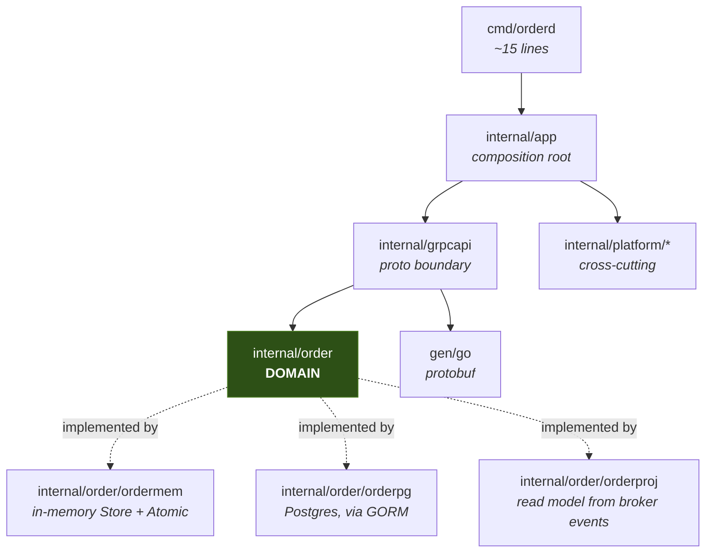

# Go gRPC Microservices Boilerplate

A production-shaped starting point for gRPC services in Go — where every architectural
decision is written down with its trade-off, and **proven by a test rather than a claim in
a README**.

Clone it, run one command, and you have a working service. No `make`, no `protoc`, no
`buf`, no Docker, no C compiler.

```bash
git clone git@github.com:pongsakorn-dev/boilerplate-go-grpc-microservices.git
cd boilerplate-go-grpc-microservices
go test ./...         # the whole default test tier -- no Docker, no protoc, no make
go run ./cmd/orderd   # gRPC on :50051, admin on :9090
```

---

## Status

This template is being built milestone by milestone. **What is here works and is tested;
what is not here is listed as not here.** A boilerplate that overstates itself wastes more
time than one that ships less.

| Area | Status | Notes |
|---|---|---|
| Proto toolchain (buf, no protoc) | ✅ Done | Codegen works offline, on Windows, with only Go installed |
| Domain layer (`internal/order`) | ✅ Done | Money, status machine, keyset pagination, shared store contract |
| gRPC transport + health + reflection | ✅ Done | Hardened server options, graceful drain |
| In-memory store (`STORE_DRIVER=memory`) | ✅ Done | Same contract the Postgres adapter will satisfy |
| Error model (`apperr`) | ✅ Done | One `Kind → gRPC code → HTTP status` table |
| bufconn test harness | ✅ Done | Tests drive the **production** server |
| LICENSE, SECURITY.md, third-party attribution | ✅ Done | Apache-2.0; `proto/third_party/` carries its own LICENSE + provenance |
| Repo/import/toolchain guard tests | ✅ Done | CRLF, import boundaries, build-tag tiers, tool pins, Taskfile portability |
| CI (Linux + Windows), golangci-lint | ✅ Done | Lint is at 0 issues; `-race` runs on Linux |
| Full interceptor chain | ✅ Done | recovery, metrics, logging, errmap, admission, auth, deadline, validation |
| Observability: slog + Prometheus + OTel traces | ✅ Done | Trace-correlated logs, `/metrics`, private pprof, OTLP export |
| Real auth (OIDC/JWKS) + default-deny policy | ✅ Done | Hostile-issuer suite, key rotation, revocation, default-deny policy the server refuses to boot without |
| Postgres via GORM + goose migrations | ✅ Done | Same store contract as the in-memory driver, plus N+1, query-plan and rollback guards |
| REST/JSON edge (grpc-gateway) | ✅ Done | Client mode over an in-process connection, so REST runs the **same** interceptors |
| Distributed rate limiting (Redis) | ✅ Done | GCRA per tenant+method, **fails open**. Cache-aside deliberately cut |
| Outbox + relay | ✅ Done | Written in the business transaction; drained by `cmd/worker`. **At-least-once** |
| NATS JetStream publisher + consumer | ✅ Done | Synchronous acks, `Nats-Msg-Id` dedup, dead-letter subject, outbox quarantine |
| Read-model projection + consumer dedup | ✅ Done | `processed_events` written in the **same transaction** as the effect |
| Outbound client + deadline budget | ✅ Done | Budget, opt-in retries, no token forwarding, upstream errors. **No production call site** — see below |
| Dockerfile, compose, kustomize | ✅ Done | 11.7 MB distroless, no shell. Manifests asserted in the default tier |
| Automated end-to-end tier | ✅ Done | Runs the **shipped** images and compose file. Found two real defects on its first run |
| Keycloak realm example | ✅ Done | Imported by a real Keycloak; a real token accepted end to end — see [`deploy/keycloak/`](deploy/keycloak/) |
| `cmd/rename`, decision index, `DELETING.md` | ✅ Done | Rename proven by renaming this repo and testing the result. `cmd/scaffold` **cut** |

> [!NOTE]
> **`AUTH_MODE=dev` is still the default, and it authenticates nobody.** That is what makes
> `git clone && go run ./cmd/orderd` work with no identity provider. It is refused when
> `APP_ENV=production`, it logs a warning on every startup, and `AUTH_MODE=oidc` is now a
> real JWT/JWKS verifier rather than a value that quietly did nothing. See
> [Authentication](#authentication) and [SECURITY.md](SECURITY.md).

---

## Quickstart

**Requirements:** Go 1.26+. That is the entire list.

```bash
go test ./...
```

That is the whole default tier. It passes with the Docker daemon stopped, no network once
the module cache is warm, and no C compiler.

### The task runner

Richer targets live in [`Taskfile.yml`](Taskfile.yml). go-task is deliberately **not** a
`go.mod` tool dependency. It declares requirements on grpc, protobuf and `x/net`, so it
would participate in module version selection for the runtime your service ships — the exact
pattern `test/toolpins_test.go` bans buf for. Removing it took `go.sum` from **352 modules to
114** and `go.mod` from **129 indirect requirements to 26**. Invoke it the way buf and
golangci-lint are:

```bash
go run github.com/go-task/task/v3/cmd/task@v3.52.0 --list-all
```

The rest of this README abbreviates that as `task`. Alias it, or just read `Taskfile.yml` —
every target is one or two plain `go` commands.

```bash
go run ./cmd/orderd
```

Boots with an in-memory store seeded with three orders, so the first call returns data
instead of an empty page.

| Listener | Address | Purpose |
|---|---|---|
| gRPC | `:50051` | The API. Reflection and `grpc.health.v1` are registered |
| Admin | `127.0.0.1:9090` | `/healthz`, `/metrics`, `/debug/pprof`. **Bound privately on purpose** |
| Gateway | `:8080` | REST/JSON, transcoded onto the same gRPC service. `GATEWAY_ADDR=""` disables it |

Poke it (install [grpcurl](https://github.com/fullstorydev/grpcurl) first — reflection means
you need no `.proto` file):

```bash
grpcurl -plaintext localhost:50051 list
```

```bash
grpcurl -plaintext -d '{}' localhost:50051 order.v1.OrderService/ListOrders
```

Other tasks — run `go tool task` to see them all:

| Command | What it does |
|---|---|
| `task gen` | Regenerate protobuf code (no protoc needed) |
| `task proto:lint` | Lint `.proto` files |
| `task doctor` | Report what this machine can run, and why it can't run the rest |
| `task test:race` | Race detector, or a clear explanation if cgo is unavailable |
| `task lint` | golangci-lint v2 |

---

## Why this template

Most Go microservice templates fail in one of two directions: they are a toy that ignores
everything hard, or they are a framework so abstracted that nobody can read them. This one
optimises for two properties instead.

**1. A stranger gets green on an unknown machine.** `git clone` → `go test ./...` passes
with nothing installed but Go. No protoc (buf compiles protos in pure Go), no make (Windows
has none), no Docker for the default tier, no cgo.

**2. Every decision has a test that fails when it is violated.** A comment saying "the
domain must not import gRPC" is a wish. A test that walks the import graph and fails the
build is a guarantee. Examples already in the tree:

| Guarantee | Enforced by |
|---|---|
| Money never touches floating point | `money_test.go` walks the AST and fails on `float64` |
| The in-memory store behaves like the real database | One contract suite runs against both |
| The order and its event commit together or not at all | Contract asserts a rolled-back tx leaves neither |
| A cross-tenant read is indistinguishable from a miss | Contract asserts `ErrNotFound`, never `PermissionDenied` |
| The documented first-run experience actually works | `test/quickstart_test.go` executes it |

---

## Repository layout

```
proto/                      .proto sources
  order/v1/order.proto      the example domain
  third_party/              VENDORED deps -> codegen works offline
gen/go/                     generated code, committed. Never hand-edited.
gen/openapiv2/              OpenAPI v2 for the REST edge, generated from the same protos

cmd/
  orderd/                   the service. ~15 lines; everything lives in internal/app
  migrate/                  goose runner. The ONLY thing that changes the schema
  worker/                   drains the outbox. A separate process on purpose
  prune/                    retention. A CronJob, separate from the relay on purpose
  devtool/                  cross-platform task helpers (Taskfile can't do filesystem work)
  rename/                   one-shot fork tool. Regenerates protos, then deletes itself

internal/
  order/                    DOMAIN. Imports no gen/, no driver, no gRPC, no telemetry
    ordermem/                 in-memory store — also backs STORE_DRIVER=memory
    orderpg/                  Postgres adapter. *gorm.DB never leaves here
    ordertest/                builders + the shared store contract
    orderproj/                read model fed by the broker. Dedup + effect in ONE transaction
  grpcapi/                  THE proto boundary. convert / errmap / server / chain / policy
  gateway/                  REST edge. Transcodes onto the SAME gRPC service, client mode
  app/                      composition root: New, Run, Close, shutdown sequencer
  platform/                 cross-cutting, service-agnostic
    config/                   the ONLY package that reads the environment
    apperr/                   Kind enum + the one Kind->code->HTTP table
    auth/                     Verifier (dev|oidc), JWKS cache, claim mapping, Policy
      testjwks/                 in-process HOSTILE issuer: alg:none, oct keys, rotation
    interceptor/              recovery, logging, errmap, admission, auth, deadline, validate
    gormx/                    tenant guard, pool config, slog adapter, query counter
    migrations/               goose .sql via embed.FS
    client/                   OUTBOUND calls: deadline budget, opt-in retries, upstream errors
    outbox/                   the relay: FOR UPDATE SKIP LOCKED, batched, at-least-once
    events/                   JetStream publisher + consumer, dead-letter, subject rules
      eventstest/               embedded nats-server. No Docker, so it runs in the default tier
    ratelimit/                GCRA quota over Redis. Tested against miniredis, no Docker
    testdb/                   testcontainers harness (build tag `integration` only)
    observability/            slog+TraceHandler, Prometheus, OTel traces, admin mux
  testutil/                 bufconn harness that boots the real server

deploy/
  docker/                   ONE multi-target Dockerfile -> three distroless images
  compose/                  local stack. postgres+redis+nats by default, more behind profiles
  keycloak/                 worked OIDC realm: audience mapper, two principal shapes
  k8s/base/                 orderd + worker Deployments, Service, PDB, HPA
  k8s/overlays/dev/         the ONE overlay. Copying it beats guessing at yours

docs/
  DELETING.md               per-subsystem removal recipes, in an order that works
  adr/                      the decision index -- reasoning lives next to the code it decided

test/                       ALL cross-cutting guards, incl. proto toolchain and Taskfile
  e2e/                      the SHIPPED artifacts: real images, real compose, real signals
```

---

## Architecture

Three layers and one rule: **dependencies point inward, and the domain points at nothing.**



`internal/order` imports only the standard library and `google/uuid`. It has never heard of
protobuf, gRPC, GORM, or OpenTelemetry.

**This is hexagonal architecture** — ports and adapters — without the vocabulary or the folder
ceremony. Four conventions that usually travel with it are deliberately absent: no
`domain`/`application`/`infrastructure` tri-layer, no inbound ports, slicing by domain rather
than by layer, and `platform/` as cross-cutting mechanism rather than "infrastructure".
[ADR 0005](docs/adr/0005-ports-and-adapters-without-the-ceremony.md) gives the reasoning for
each, the two real costs, and the escape seam for a fork that wants the full tri-layer.

**Why this is worth the mapping code in `convert.go`:** it means a proto field rename is a
change to one file instead of a database migration, and it means the business tests run in
milliseconds with no Docker. Once `*pb.Order` reaches your SQL layer, undoing that is a
simultaneous rewrite of every layer — this is the one boundary that is expensive to add
later and cheap to keep from day one.

The domain defines **ports**; adapters implement them:

```go
type Store interface {
    Create(ctx context.Context, o Order) error
    Get(ctx context.Context, tenantID, orderID string) (Order, error)
    List(ctx context.Context, tenantID string, f ListFilter) (Page, error)
    Update(ctx context.Context, o Order) error
}

// The callback receives the DOMAIN interfaces, never *gorm.DB.
// The publisher is passed alongside the store because the outbox row MUST be
// written by the same transaction as the business change.
type Atomic interface {
    InTx(ctx context.Context, fn func(Store, EventPublisher) error) error
}
```

Hand a driver type to that callback instead and three things break at once: the domain has
to import the driver, the in-memory fake can no longer implement it, and every transactional
business test silently becomes a Docker test.

### Request path

```
client
  -> recovery      panic containment
  -> metrics       counts shed load too, so it sits outside admission
  -> logging       observes the FINAL code, because errmap is below it
  -> errmap        domain error -> gRPC status + google.rpc details
  -> admission     concurrency limit, BEFORE auth
  -> auth          establishes the principal
  -> deadline      bounds the handler and everything downstream
  -> validate      protovalidate, from rules declared in the .proto
  -> OrderServer -> order.Service -> Store
```

**`errmap` is not innermost, and that placement is the subtle one.** "Innermost" is the
intuitive choice and it is wrong: an interceptor only maps errors from what it *wraps*.
Placed last it wraps the handler alone, so rejections from admission, auth and validation
sail past it unmapped and reach the client as `codes.Unknown` — and those are the errors
clients hit most often.

The real requirement is two-sided: below logging and metrics (so they record the mapped
code), and above every interceptor that produces an error (so those get mapped at all).
`internal/grpcapi/chain_test.go` caught this by asserting outcomes rather than reading the
list.

**A caller hanging up is not a server fault**, and `apperr` has Kinds for it — `KindCanceled`
(`codes.Canceled`, HTTP 499) and `KindDeadlineExceeded` (`codes.DeadlineExceeded`, HTTP 504).
Without them a handler returning `ctx.Err()` fell through to the unclassified branch and
became `Internal`: the client that had just disconnected was told the server broke, and every
routine cancellation was counted in the `Internal` error-rate series. That series is the one
worth paging on, and a permanent floor of closed tabs is how it stops being trusted. The
give-away that this was always a mistake: `HTTPStatusFromCode` already had a careful arm
mapping `Canceled` to 499, explaining that exact reasoning — and nothing in the service could
produce `codes.Canceled`, so the arm could never run.

---

## Testing

Tiers are separated by **build tags, never `testing.Short()`**. A `Short()` skip still links
testcontainers into every test binary; a build tag makes the default tier's dependency set a
compile-time guarantee. That is the only way `go test ./...` is safe with Docker stopped.

| Tier | Command | Infra | Measured on this machine |
|---|---|---|---|
| Default | `go test ./...` | none | **12s** cold cache, **1.5s** cached |
| Codegen | `task verify:codegen` | network | **17.6s** — regenerates and byte-compares |
| Profile | `task verify:profile` | none | **17s** — executes [`docs/DELETING.md`](docs/DELETING.md): removes each optional subsystem in the documented order and rebuilds after each |
| Integration | `task verify:int` | Docker | **20s** with the image cached. **Skips**, never fails, without Docker |
| End-to-end | `task verify:e2e` | Docker + compose | **~140s** — the shipped images and compose file, real SIGTERM, and a second stack running `AUTH_MODE=oidc` against a real Keycloak. **Skips visibly**, never fails, without Docker |
<!-- fork-tool:begin -->
There is a seventh tier that is not in the table above, because it deletes itself along with
the tool it covers: `task verify:rename` (no Docker, **26s**) renames a copy of this whole
repository, then builds and tests the result.

It sits outside the table for a mechanical reason worth knowing if you add another removable
section. `cmd/rename` strips whatever lies between its two `fork-tool` HTML-comment markers,
and an HTML comment on its own line is a block-level element — so wrapping a table *row* in
them terminates the table at the opening marker, and every row after it renders on GitHub as
a paragraph of literal pipe characters. Which is what this row used to do. Removable content
therefore lives in its own paragraph, never inside a table.

(The markers are deliberately not spelled out here: `cmd/rename` searches for those exact
strings, so quoting them in prose invents a marker and the tool fails on an unmatched pair.
It does — that is how this paragraph was first written.)

<!-- fork-tool:end -->

### Guard tests

`test/` holds tests that assert nothing about business behaviour — they exist to
stop the template rotting. Each has been verified to actually **fail** when violated, not
merely to pass today:

| Guard | Catches |
|---|---|
| `TestNoCRLFInTrackedFiles` | Line endings that would break codegen diffs and golden files |
| `TestDomainImportsNothingHeavy` | The domain reaching for gRPC, GORM, protobuf, OTel |
| `TestPlatformDoesNotImportServices` | `platform/` becoming order-service helpers |
| `TestOnlyConfigReadsTheEnvironment` | A stray `os.Getenv` three layers down |
| `TestBannedToolsAreNotToolDependencies` | buf/golangci-lint entering the `tool` directive |
| `TestBufVersionIsConsistent` | The three buf pins drifting apart |
| `TestNoForbiddenShellCommands` | A Taskfile line that only works on Unix |
| `TestFilePathsAreQuoted` | Unquoted paths breaking on `C:\Program Files\...` |
| `TestDefaultTierNeedsNoDocker` | Docker deps leaking into the default tier |
| `TestTaggedTestsHaveAValidConstraint` | A `//go:build` missing its blank line, silently ignored |
| `TestSynctestIsNotUsedWithRealNetworking` | A synctest bubble that would hang forever |
| `TestGeneratedCodeIsUpToDate` | Committed `gen/` drifting from the `.proto` |
| `TestAllProtoFieldsAreAcknowledged` | A new proto field silently never mapped |
| `TestEveryKindIsMapped` | A new error Kind with no gRPC/HTTP row |
| `TestInternalErrorsNeverLeakAndNeverLose` | Driver text reaching a client, or vanishing from the log |
| `TestSecretIsRedactedThroughEveryEscapeRoute` | A password escaping via fmt, JSON **or** slog |
| `TestValidateRejectsDevAuthInProduction` | `AUTH_MODE=dev` reaching production |
| `TestGatewayCanActuallyBeDisabled` | A documented off-switch that the parser turns back on — `GATEWAY_ADDR=""` reading as unset and publishing HTTP anyway |
| `TestTraceHandlerPassesTheStdlibConformanceSuite` | A wrapping slog handler breaking `WithGroup` |
| `TestTraceHandlerSurvivesWith` | Derived loggers silently losing trace correlation |
| `TestPprofIsOnDefaultServeMuxButWeNeverServeIt` | Profiling endpoints on a public listener |
| `TestAdmissionReleasesSlotOnPanic` | A panicking handler permanently consuming a slot |
| `TestTheLivenessProbeIsNotShed` | Load shedding failing the liveness probe, so the kubelet restarts pods out of an overloaded service |
| `TestTheProbeExemptionDoesNotLeakToOtherMethods` | That exemption widening into a shed-control bypass any caller can name |
| `TestCommentsDoNotCiteMissingTests` | A comment claiming a proof that does not exist |
| `TestCommentsDoNotCiteMissingSourceFiles` | A comment citing a **source** file that was never written — usually a mechanism that was never built |
| `TestContextErrorsAreNotOurFault` | A client hang-up reported as `Internal`, putting a floor of disconnects under the alert on-call pages on |
| `TestAnUpstreamErrorCannotBeReturnedByAccident` | An upstream's `NotFound` reaching your caller as if it were about *their* request |
| `TestVendoredProtosKeepTheirLicenseHeaders` | Apache-2.0 attribution being stripped from vendored protos |
| `TestRootLicenseNamesItsCopyrightHolder` | The root LICENSE losing its copyright holder to a rename substitution |
| `TestEveryTenantScopedTableHasAGuardedModel` | A new tenant table whose model forgot `TenantColumn`, so every query silently returns every tenant's rows |
| `TestNoExemptionOutlivesItsTable` | That guard's allowlist outliving the table it excuses |
| `TestGoModIsTidy` | `go.mod` misreporting what this repo depends on — a direct dependency left marked `// indirect` |
| `TestEveryEndToEndTestSkipsWhenTheStackIsMissing` | An e2e test that runs against a stack nobody started, instead of skipping |
| `TestTaskTargetsReferenceRealPaths` | A task target pointing at a file that does not exist |
| `TestBannedToolsAreNotToolDependencies` | A build tool entering the production module graph |
| `TestErrorsAreMappedBeforeLoggingObservesThem` | Interceptor order regressing to `codes.Unknown` |
| `TestRecoveryThroughTheRealChain` | A recovered panic leaking its raw value to the client |
| `TestPolicyCoversEveryDeclaredRPC` | An RPC shipping with no authorisation decision |
| `TestPolicyRulesAllReferenceRealMethods` | A rule left behind by a rename, protecting nothing |
| `TestReadAndWriteScopesAreActuallySeparated` | A read-only credential able to mutate |
| `TestVerifyRejectsHostileTokens` | `alg:none`, wrong `aud`, missing `exp`, unknown `kid` |
| `TestKeyAlgorithmBindingIsEnforced` | An algorithm substitution within one key type |
| `TestRevokedKeysStopBeingTrusted` | A revoked signing key trusted until the pod restarts |
| `TestSlowRefreshDoesNotStallCachedVerifications` | One unauthenticated request stalling all auth |
| `TestDiscoveryRecoversAfterAFailedFirstAttempt` | A pod serving Unauthenticated forever after an IdP blip |
| `TestRealmSetsTheAudienceOnEveryTokenIssuingClient` | The Keycloak realm losing its audience mapper |
| `TestUnitsBoundLeavesRoomForNanos` | A money bound that guards the multiplication but not the `+Nanos` after it, so a *valid* amount wraps to negative |
| `TestStatusRoundTripsThroughItsName` | Stored status names drifting from the Go constants |
| `TestTenantScopedOfUnwrapsEveryShapeGORMProduces` | The tenant guard silently not applying to `Find(&[]T{})` |
| `TestTenantGuardFailsClosed` | A query with no tenant returning **every tenant's rows** |
| `TestListDoesNotNPlusOne` | 50 orders costing 51 queries instead of 2 |
| `TestKeysetPaginationSeeksRatherThanFilters` | A rewrite that keeps the index but loses the seek |
| `TestMigrationsRoundTrip` | A `down` block that does not work, discovered mid-release |
| `TestRESTGoesThroughTheInterceptorChain` | The REST edge bypassing auth, authz, limits and error mapping |
| `TestUnknownJSONFieldsAreRejected` | A client typo silently becoming an empty field |
| `TestOpenAPIFieldNamesMatchWhatTheServerEmits` | A published schema that disagrees with the running service |
| `TestReadmeDocumentsEveryPackage` | A package on disk and nowhere in these docs |
| `TestRateLimitIsACTUALLYWIREDINTOTheChain` | A correct limiter that the server never calls |
| `TestLimiterFailsOPENWhenRedisIsDown` | A dead quota store taking the whole service down |
| `TestRejectionDoesNotExtendThePenalty` | A retrying client extending its own lockout indefinitely |
| `TestKeysAreIndependent` | One noisy tenant throttling everybody |
| `TestConcurrentRelaysDoNotBlockOnEachOther` | A second relay that waits instead of helping |
| `TestAFailedPublishAbandonsTheWholeBatch` | A half-marked batch losing events on broker failure |
| `TestGracePeriodExceedsTheDrainSequence` | A manifest that SIGKILLs the pod mid-request on every deploy |
| `TestAllThreeProbesAreNativeGRPC` | A probe checking a port that isn't the one serving traffic |
| `TestResourcesAreDeclaredWithNoCPULimit` | A CPU limit causing CFS-throttled p99 latency |
| `TestAdminPortIsNotInTheService` | pprof reachable by anything in the cluster |
| `TestNoOverlayPatchesEnvByIndex` | An overlay addressing `env/5` by position, silently retargeting the moment the base reorders |
| `TestCloseDrainsOutsideIn` | The gateway shutting down *after* the gRPC server it forwards to — 500s on every deploy |

### The pattern worth stealing: one contract, two implementations

`ordertest.RunStoreContract` is a single suite of 16 behaviours. It runs unchanged against
the in-memory store (microseconds, no Docker) and — from M4 — against real Postgres in
testcontainers.

That is what makes the fast tier *trustworthy*. When a business test uses the in-memory
store and passes, it passes against behaviour real Postgres has also been shown to have. A
hand-written fake that nothing holds to a contract is just a second implementation of your
bugs — and unlike a generated mock, a fake can be *proven* equivalent to the real thing.

The sixteenth behaviour is the clearest example of why the suite is shared. A page token
whose id has been edited — while keeping the filter hash valid, which is possible because the
hash covers the *filter*, not the id — used to return no error at all from the in-memory
store and `invalid input syntax for type uuid` from Postgres, i.e. a **500 for
caller-supplied input**. Two implementations, two different wrong answers, and a unit test
against either one alone would have argued the other was fine. `order.decodeCursor` now
rejects a non-uuid id, so both agree on `InvalidArgument`.

Assertions only Postgres can make (SQLSTATE mapping, `FOR UPDATE SKIP LOCKED` disjointness,
index usage) live in the adapter's own test file, not in the shared contract.

---

## Key decisions

Each links to where it lives. The full trade-off analysis for every one of these is in the
implementation plan; the short version:

| Decision | Choice | Why not the alternative |
|---|---|---|
| Transport | grpc-go + grpc-gateway | Connect-RPC's one-port win evaporates once pprof/metrics need a private listener, and it invalidates the entire go-grpc-middleware / otelgrpc / bufconn ecosystem |
| Proto codegen | [buf](buf.gen.yaml) via `go run …@v1.72.0` | **Never** the `tool` directive — buf's own docs forbid it, since MVS would silently move your protobuf *runtime* to satisfy a build tool |
| Codegen plugins | [`tool` directive](go.mod) | Here it is exactly right: sharing a module graph with `google.golang.org/protobuf` makes generator/runtime skew structurally impossible |
| Third-party protos | [vendored](proto/third_party/) | BSR deps resolve into a cache `go mod download` never warms, which would make "generate offline" false |
| Domain boundary | [mapping layer](internal/grpcapi/convert.go) | Passing `*pb.Order` to storage makes a field rename a migration |
| Money | [integer units + nanos](internal/order/money.go) | `float64` cannot represent `0.10`; the drift reconciles fine in tests and wrongly at month end |
| IDs | UUIDv7 | v4 is uniformly random, so every insert lands in a random B-tree page. Trade-off: v7 leaks creation time |
| Pagination | [keyset](internal/order/cursor.go) | `OFFSET` skips and repeats rows when data changes mid-page. Retrofitting keyset is a breaking API change **plus** an index change |
| Wiring | [manual constructors](internal/app/app.go) | A missing dependency is a compile error, not a runtime one. Adding fx/wire later is additive; removing either is a rewrite. `google/wire` is archived |
| Time in tests | `testing/synctest` | No `Clock` interface — the stdlib made that abstraction unnecessary in Go 1.25 |
| Assertions | stdlib + `go-cmp`/`protocmp` | One assertion idiom, not two. Adding testify later is purely additive |
| Task runner | [Taskfile](Taskfile.yml) via `go run …@v3.52.0` | No Makefile: Windows has no `make`. **Not** the `tool` directive — go-task requires grpc, protobuf and `x/net`, so it would join version selection for the runtime your service ships. Task's shell has no `rm`/`sed`/`jq` either, so those live in `cmd/devtool` |

---

## Deployment

```bash
task up              # postgres + redis. Add --profile auth for Keycloak, obs for Grafana
task docker:build    # all four images from one Dockerfile
task verify:deploy   # build the kustomize overlays (needs kubectl)
```

### One Dockerfile, four targets

`orderd`, `migrate` and `worker` share a build stage, so the Go version can't drift between
them. Measured:

| Image | Size |
|---|---|
| `orderd` | **11.7 MB** |
| `worker` | 7.1 MB |
| `migrate` | 4.3 MB |

`distroless/static:nonroot` — no shell, no package manager, no libc. An attacker with
arbitrary file write and no way to execute a shell is dramatically less dangerous than one
with `/bin/sh`. Verified: `docker run --entrypoint /bin/sh` fails, and the image runs as
`nonroot:nonroot`.

Which is also why every `ENTRYPOINT` is **exec form**. Shell form wraps the process in
`/bin/sh -c` — which doesn't exist here, and where it does, it makes the shell PID 1 so
SIGTERM never reaches the Go process. The pod then sits out its whole grace period and gets
SIGKILLed mid-request on every deploy.

Verified rather than asserted: `docker stop` returned in **5.7s** — the drain delay plus
shutdown — not the 30s timeout, with `shutdown signal received` and `health set to
NOT_SERVING, draining` in the logs.

### Compose starts two containers, not eight

Postgres and Redis by default. Keycloak (`--profile auth`), Grafana/Tempo/Prometheus
(`--profile obs`) and the app itself (`--profile app`) are opt-in. A compose file that starts
eight services is one people stop using — the JVM alone costs more startup than the rest of
the stack combined.

The application is deliberately *not* in the default set: running it on the host against these
containers iterates faster, and hot reload actually works, which it doesn't across a Windows
bind mount because inotify events don't cross it.

### Manifests are asserted in the default tier

`deploy/k8s/manifest_test.go` runs in plain `go test ./...` — no cluster, no kubectl, no new
dependencies. The assertion that matters most spans two files and no YAML linter can make it:

> `terminationGracePeriodSeconds` (40s) must exceed `SHUTDOWN_DRAIN_DELAY` +
> `SHUTDOWN_GRACE_PERIOD` (5s + 25s), read from the **Go defaults the binary compiles in**.

Get it wrong and the kubelet SIGKILLs mid-request on every deploy, presenting as intermittent
5xx during rollouts that nobody can reproduce afterwards. Two numbers, two files, no reference
between them.

Also asserted: all three probes are **native `grpc:`** (GA since 1.27 — no `grpc_health_probe`
binary in a distroless image) and hit the RPC port rather than a port that could be healthy
while the real one isn't; `readOnlyRootFilesystem`, `runAsNonRoot`, `drop: [ALL]`,
`seccompProfile: RuntimeDefault`; and the admin port is **absent from the Service**, because
exposing `/debug/pprof` cluster-wide hands a heap dumper to anything that can resolve the name.

**No CPU limit, deliberately.** A CPU limit causes CFS throttling: a Go service that briefly
exceeds its quota is stalled for the rest of each 100ms period, producing p99 latency with no
visible CPU saturation. Requests schedule; CPU limits mostly just hurt. Memory keeps its limit
because memory isn't compressible.

> **Why `yaml.v3` and not krusty.** Building the overlays with `sigs.k8s.io/kustomize/api`
> would also verify composition — but it adds 22 modules and, decisively, `kustomize/api`
> requires `google.golang.org/protobuf`, so a *manifest linter* would join MVS for this
> service's production protobuf runtime. That's the same argument this repo already used to
> keep `buf` and `go-task` out of the tool directive. So: `yaml.v3` (already a dependency)
> checks the content everywhere, and `task verify:deploy` checks composition with kubectl.

### One overlay, not three

`base` + `dev`. Staging and prod would be empty scaffolding: a template can't know your
namespaces, registry, secret manager or ingress. Copying `dev/` is a two-minute job producing
something true; shipping two directories of guesses produces something that looks
authoritative and isn't.

---

## The outbox

The domain writes an event row **inside the same transaction** as the business change, so
*"the order committed but the event vanished"* is not a state the database can hold. A
separate process drains it:

```bash
go run ./cmd/worker
```

### What it guarantees, precisely

| | |
|---|---|
| ✅ **No lost events** | The row and the business change commit together, or neither does |
| ✅ **At-least-once** | Every event reaches the broker at least once |
| ❌ **Not exactly-once** | If the broker accepts a publish and the marking transaction then fails, the event is republished. **Consumers must deduplicate** |
| ❌ **Not globally ordered** | Two relays claim disjoint batches concurrently, so event 20 can arrive before 19 |
| ⚠️ **Per-aggregate order** | Holds only with a **single** relay. Two can split one order's events and finish out of order |

Anyone claiming exactly-once delivery has moved the deduplication somewhere you haven't
looked yet. Those last two are the ones that bite, so they're written down rather than
discovered.

### `FOR UPDATE SKIP LOCKED` — measured, not assumed

The claim query is what makes running more than one relay useful. Against Postgres 17, with
one transaction holding rows 1–10 and a second issuing the identical claim under a 400ms
`lock_timeout`:

| | Second transaction |
|---|---|
| `FOR UPDATE` | **Blocks**, then dies: `canceling statement due to lock timeout (SQLSTATE 55P03)` at 403ms |
| `FOR UPDATE SKIP LOCKED` | Returns rows 11–20 in **1ms** |

The difference is invisible in the *results* — both eventually publish every row exactly
once. Only the **blocking** distinguishes them, which is why
`TestConcurrentRelaysDoNotBlockOnEachOther` asserts that both relays reach `Publish`
concurrently rather than asserting on what they published.

That test took two attempts. The first gave each relay a batch big enough for the whole table
and checked no row shipped twice — it passed while proving nothing, because one relay claimed
everything and the other claimed none, which is the identical outcome with or without
`SKIP LOCKED`.

### The transaction is held across the publish

Deliberate, and a real trade-off. Holding it is what makes failure safe: if the broker rejects
a message or the process dies mid-batch, the transaction rolls back, `published_at` stays
`NULL`, and the next drain reclaims the rows. Nothing is lost and no reconciliation job is
needed.

The cost is a database transaction open for the duration of the batch's network I/O, which
bloats vacuum and inflates replication lag if the batch is large or the broker slow. Hence
`OUTBOX_BATCH_SIZE`. A fork under real load should switch to a **lease** — claim with a short
`UPDATE` stamping `claimed_at`, commit, publish outside any transaction, then mark published —
which needs lease expiry to recover from a crashed relay, exactly the complexity this version
avoids while the volume doesn't demand it.

A partial failure abandons the **whole** batch. Marking the successful ones would need a second
transaction and leaves the batch half-committed if that fails too. Rolling back republishes a
few messages the broker already took — a duplicate the at-least-once contract already requires
consumers to handle. Trading a duplicate for a lost event is never the right way round.

### Why a separate process

Running the relay inside `orderd` ties publishing throughput to however many API replicas the
HPA happens to have chosen: a traffic lull that scales the API down also slows event delivery,
and scaling up for latency multiplies the relay's database load for nothing. Different
bottlenecks, different replica counts — and a relay stuck on an unavailable broker shouldn't
consume resources in the process serving customers.

### Quarantine: one bad event must not stop the rest

The whole-batch rollback above is right when every failure is transient — a broker restart
heals itself. It is a **total outage** when a failure is not. A payload above the NATS
server's `max_payload` (1 MiB by default) is rejected identically on every attempt, so without
special handling the relay reclaims that row, fails, rolls back, and never reaches a single
row behind it: the whole service's event stream stopped by one message, with nothing in the
logs but the same error repeating.

So `Publish` distinguishes **permanent** from transient failures, and a permanent one
quarantines the row — `failed_at` set, reason recorded, skipped by the claim query. Nothing is
deleted, so an operator who fixes the cause replays it:

```bash
psql -c "UPDATE outbox SET failed_at = NULL, failure_reason = NULL WHERE id = 42;"
```

`TestClearingFailedAtReplaysAQuarantinedRow` runs exactly that statement, because a recovery
procedure nobody has executed is a recovery procedure that does not work.

The default direction matters: **anything unmarked is transient.** Calling a transient failure
permanent quarantines data that was fine; calling a permanent one transient only wastes
retries until someone looks. Only one of those is recoverable.

---

## The broker: NATS JetStream

`NATS_URL` turns the relay's placeholder publisher into a real one. Empty keeps
`outbox.LogPublisher`, which prints exactly what *would* be sent — so a fresh clone exercises
claiming, batching, the marking transaction and at-least-once semantics with no broker
installed anywhere.

```bash
docker compose -f deploy/compose/docker-compose.yml up -d
```

```bash
NATS_URL=nats://localhost:4222 go run ./cmd/worker
```

### The tenant is not in the subject

The obvious subject layout is `{prefix}.{tenant}.{event_type}`, so a consumer can filter one
tenant with `events.acme.>`. It is what most examples show. It is a **tenant isolation
failure**, and not a hypothetical one:

| | |
|---|---|
| `tenant_id` | `acme.com` |
| subject | `events.acme.com.order.created` |
| a consumer filtering | `events.acme.>` |
| result | **receives it** |

A dot in a tenant id is not an attack — `acme.com` is an ordinary tenant id, and any identity
provider issuing domain-shaped or email-shaped tenants produces one on the first customer.
NATS subjects are dot-delimited with no escaping, so the tenant silently becomes two tokens
inside a *different* tenant's subtree. `TestTheTenantIsNotInTheSubject` reproduces it against
a real embedded server, then asserts the shipped publisher does not do it.

Rejecting such tenants at publish time would be worse: the relay would fail forever on a row
it can never publish, blocking every event behind it, for a customer whose only crime was
having a domain name. So the subject carries only the event type, and the tenant travels as a
header. Per-tenant filtering, if you need it, is a per-tenant **stream**.

### What the broker adds, and what it does not

| | |
|---|---|
| ✅ **Acked before marked** | `Publish` waits for JetStream to confirm it stored the message. The async API returns as soon as the bytes hit the socket — using it would let the relay mark a row published that the broker never kept |
| ✅ **Relay duplicates collapse** | Every message carries `Nats-Msg-Id`; JetStream drops a repeat inside `NATS_DUPLICATE_WINDOW`. This is what makes the whole-batch rollback cheap |
| ❌ **Duplicates not eliminated** | A republish *after* the window is a new message, and redelivery after a crash is not deduplicated at all |
| ✅ **Effectively-once processing** | `processed_events` — the consumer's dedup row and its effect in one transaction. This is the boundary that actually holds |

The deduplication id is namespaced by service (`orderd-42`, not `42`). Outbox ids are unique
per *database* and every service's outbox starts at 1, so two services sharing a stream would
both publish id `1` — and JetStream would silently drop the second as a duplicate. A lost
event, no error anywhere, discovered eventually by a consumer that never received something
the publisher believes it sent. `config.Validate` also refuses a `NATS_DUPLICATE_WINDOW`
shorter than `OUTBOX_POLL_INTERVAL`, because a republished batch arriving after the window is
stored twice.

### JetStream has no dead-letter queue

Once deliveries exceed `MaxDeliver` the server stops redelivering and emits an advisory on
`$JS.EVENT.ADVISORY.CONSUMER.MAX_DELIVERIES` that **nothing subscribes to** unless you build
it. Out of the box the message is simply gone, and no log anywhere mentions it.

So the consumer dead-letters explicitly, to `dlq.{original subject}`, with the reason and the
attempt count in headers. A **poison** message — one marked permanent, such as a payload that
will never parse — is dead-lettered on the *first* attempt rather than burning five retries to
reach the same place; anything else is retried with backoff and dead-lettered on the last one.

Three details that are each one line of code and one real failure:

1. **The copy is published before the original is terminated.** Terminating first loses the
   message whenever the copy fails — and a broker unhealthy enough to reject it is exactly
   when messages are failing.
2. **The copy gets a fresh `Nats-Msg-Id`.** Reusing the original's deduplicates the dead
   letter against the live message still in the stream, so it is never stored and the message
   vanishes exactly as it would have with no DLQ at all. Found by sabotage.
3. **The consumer filters `events.>`**, so it never eats its own dead letters. Removing that
   filter produced **1005 handler runs for one message in two seconds**; `config.Validate`
   refuses a DLQ prefix nested inside the consumer's filter for the same reason.

### The consumer: dedup and effect in one transaction

`cmd/worker` runs the relay and a consumer concurrently and independently — a consumer stuck
on a slow projection must not stop the relay draining, or a downstream problem becomes an
upstream one.

The consumer maintains a read model (`order_counts`), which is the canonical thing an outbox
feeds and the case where duplicate delivery is *visible*: apply `OrderCreated` twice and the
count is wrong, and stays wrong tomorrow. Every handler does this:

```sql
BEGIN;
  INSERT INTO processed_events (consumer, message_id) VALUES ($1, $2)
    ON CONFLICT (consumer, message_id) DO NOTHING;
  -- zero rows affected => already applied, so ack and skip
  -- ... the business effect ...
COMMIT;
```

Any arrangement where those are separate transactions has a window: record first and crash and
the event is lost forever; apply first and crash and it is applied twice on redelivery.
Nothing can tell afterwards which side of the window the crash fell on.

`ON CONFLICT` is also what makes it safe with several workers. Two replicas handed the same
message both reach that `INSERT`; the second blocks on the first's uncommitted row and then
sees the conflict, instead of reading "not processed yet" and double-counting.
`TestTwoWorkersHandedTheSameEventApplyItOnce` runs eight goroutines against real Postgres —
replacing the atomic claim with a read-check-write fails it immediately.

`processed_events` is keyed by **(consumer, message_id)**, not by message alone. Keying on the
message would let whichever consumer ran first silently suppress the event for every other
consumer of the same stream.

### Booted, not asserted

Two orders created through the REST edge against the compose stack:

```
outbox            2 rows written in the business transaction, both marked published
stream EVENTS     2 messages, subjects [events.>  dlq.>], dup window 120s, file storage
consumer          order-projection, filter events.>, ack_pending 0, redelivered 0
order_counts      dev-tenant  ->  2
processed_events  orderd-1, orderd-2
```

Then `UPDATE outbox SET published_at = NULL WHERE id = 1`, forcing the relay to republish:

```
worker log        "jetstream deduplicated a republished event" outbox_id=1
stream EVENTS     still 2 messages
order_counts      still 2
```

That is the interlock the whole design rests on, observed rather than described.

### The trace crosses the broker

Every other hop in this system propagates trace context in-band — gRPC metadata, an HTTP
header, something the caller is holding while the callee runs. The outbox is the one place
where producer and consumer are separated by **time** rather than by a network: the request
that wrote the row returned long ago, its context is cancelled, and the relay is a different
process on a timer that has never heard of it.

So the context is stored as data. `orderpg` renders the active span into `outbox.trace_parent`
at write time — in the adapter, because `internal/order` imports no telemetry SDK and
`test/layout_test.go` enforces that — the relay selects the column, the publisher sends it as a
W3C `traceparent` header, and the consumer resumes it and opens a child span. A dead letter
keeps it too, which is the case where it matters most.

The column is nullable and empty is normal: a row written outside any span simply produces an
event that begins its own trace.

**Finding it took an end-to-end test, and it found a second defect first.** The same
`traceparent` sent over both surfaces produced a populated `trace_parent` via gRPC and an empty
one via REST. grpc-gateway's default header matcher forwards `Grpc-Metadata-*` and a fixed list
of permanent HTTP headers; W3C Trace Context is on neither, so an instrumented HTTP client's
trace was discarded at the edge while the gRPC path worked perfectly — which is why every
existing test passed. `internal/gateway` now forwards `traceparent` and `tracestate` explicitly.

### Watching the outbox

Two failures here are completely silent from outside the process. A **quarantined** row — one
the relay gave up on — is skipped by every future drain, and nothing mentions it again, so an
event sits undelivered until somebody happens to look. And a relay **wedged** on a broker that
accepts connections but never acks keeps running, logging nothing, with a healthy process and a
backlog growing without bound.

The worker exports both on a private admin listener (`ADMIN_ADDR`, `:9090` in the pod):

| Series | What a rise means |
|---|---|
| `gomicro_outbox_quarantined_rows` | Undelivered events that no drain will retry. Above zero, somebody has to clear `failed_at` |
| `gomicro_outbox_oldest_pending_age_seconds` | Nothing is draining. **This is the one to page on** |
| `gomicro_outbox_pending_rows` | Publishing is slower than writing |
| `gomicro_outbox_last_observation_timestamp_seconds` | Alert on **staleness**: if the observer dies, every gauge above freezes at a healthy-looking value |

`gomicro_outbox_oldest_pending_age_seconds` is the one that matters, because it is the only
one a merely-running process cannot satisfy — which is exactly what a liveness probe cannot
give you, and why the worker has a listener but still no probes.

**The observer runs on its own clock, not the relay's**, and that is the whole design. The
gauge exists to detect a relay that has stopped making progress; if the relay refreshed it, the
same wedge would stop it updating and freeze it at its last value. A frozen gauge reads as a
stable, healthy system on a dashboard — the metric would go quiet at exactly the moment it had
something to say. `OUTBOX_OBSERVE_INTERVAL` is deliberately separate from `OUTBOX_POLL_INTERVAL`
for that reason, and an integration test asserts the age keeps climbing while nothing drains.

### Retention

`outbox` and `processed_events` are append-only. The relay must not delete what it publishes
and the consumer must not delete its own dedup rows, so without something outside both of them
these become the largest tables in the database, without bound.

[`cmd/prune`](cmd/prune/main.go) is that something — a separate binary on a schedule, not a
goroutine in the worker. Draining the outbox and pruning it have opposite urgency: a drain that
stops means events are not being delivered and someone should be woken, while a prune that
stops means a table is bigger than it should be and someone should look next week. Running the
`DELETE` inside the relay's loop couples those, so lock pressure from housekeeping becomes a
delivery outage.

**`RETENTION_PROCESSED_EVENTS` must exceed `NATS_STREAM_MAX_AGE`, and startup refuses a
configuration where it does not.** That is a correctness boundary rather than a preference. A
dedup row is safe to delete only once the broker can no longer deliver its message — which is
when the stream's own retention has dropped it. Delete it an hour early and a redelivery lands
on a consumer with no memory of having seen it: the projection applies the event twice, and
nothing reports it. No error, no metric, and the events that caused it are gone from the stream
by the time anyone reconciles the numbers. The shipped defaults leave a day of margin.

**Quarantined rows are never pruned, at any age.** A row with `failed_at` set was never
published and stays until an operator clears it — which makes it, by construction, the oldest
row in the table and the first thing an age-based sweep would reach. What prevents that is
ageing on `published_at` rather than `occurred_at`: an unpublished row has no `published_at`,
and `NULL < timestamp` is `NULL`, which `WHERE` treats as false. Pending and quarantined rows
are ineligible automatically.

Run the dry run before the first real one — it is the only run that deletes months at once:

```bash
go run ./cmd/prune -dry-run
```

The exit code carries one signal worth alerting on. A prune stopped by SIGTERM exits **0** —
the cluster is taking the pod away and the committed batches are kept. A prune that hits its
`-timeout` exits **non-zero**, and that means retention is falling behind the write rate: the
schedule is too infrequent, or `RETENTION_BATCH_SIZE` too small. It is self-worsening, because
every run that does not finish leaves more for the next one.

---

## The end-to-end tier

```bash
task verify:e2e
```

Everything else here tests the code. This tests **what is deployed**: the real Dockerfile, the
real compose file, the real images, real SIGTERM. ~95s for this package and ~145s for the
tier including the OIDC stack, behind `//go:build e2e` because
it needs a Docker daemon.

The distinction is not academic. On its first run it found two defects that had shipped, both
living in files no Go test reads:

**The compose healthcheck could never pass.** It ran `/orderd --help`, a flag the binary did not
parse — so instead of printing usage it started a *second* server inside the container and raced
the first for the port. `compose up --wait` would hang and then fail.

**Fixing that made it worse before it made it better.** Adding flag parsing to support a real
`-health` command meant `--help` began printing usage and exiting **zero** — turning a
healthcheck that could never pass into one that could never fail. Those are opposite failures
and only one is loud:

| | |
|---|---|
| never passes | **loud.** `up --wait` errors and everyone notices |
| always passes | **silent.** The orchestrator believes a dead service is healthy, keeps routing to it, and never restarts it |

Every other test in this tier would still pass with an always-green healthcheck, because they all
talk to the service directly. The test that catches it reads the healthcheck **out of the running
container** and runs it against nothing, requiring it to fail. Hardcoding the command instead —
which is what the first version did — proves only that `-health` works, and says nothing about
whether compose uses it.

The image has no shell, no curl and no `grpc_health_probe`, so `orderd -health` dials its own
gRPC health endpoint. Kubernetes needs none of this: it has had native `grpc:` probes since 1.27.

### Shutdown is measured, in both directions

`docker stop` returns in **5.7s** against a 30s timeout — the number M10 measured by hand, now
asserted on every run. The assertion is two-sided, and the lower bound was learned from a
sabotage rather than reasoned:

| Stop takes | What it means |
|---|---|
| **near 30s** | SIGTERM never reached the process. That is a shell-form `ENTRYPOINT`: PID 1 is `/bin/sh`, which forwards nothing, so every deploy SIGKILLs mid-request |
| **under 5s** | The signal arrived and nothing handled it. Go's runtime kills the process on an unhandled SIGTERM, so this is **faster** than a healthy drain |
| ~5.7s | Health flipped, `SHUTDOWN_DRAIN_DELAY` elapsed, connections drained |

Removing `syscall.SIGTERM` from the signal set stops the container in **706ms** — comfortably
inside an upper bound alone. The first version of that test passed under exactly that sabotage.

### What else it asserts

- The stack serves the same order over **both** REST and gRPC — the transcoder really is in
  front of the same service.
- The data is really in Postgres, not the in-memory store. Drop `STORE_DRIVER` and every other
  test still passes; only this one notices that everything vanishes on restart.
- `migrate` ran to completion **before** `orderd` accepted traffic, and the schema is current.
- The full async path in containers: order → outbox → relay → JetStream → consumer →
  `order_counts`, with nothing unpublished and nothing quarantined.
- The image contains no shell — `/bin/sh`, `/bin/bash` and `/busybox/sh` all fail to execute.

> [!NOTE]
> `task verify:e2e` passes `-count=1`, and that is required rather than tidy. Go's test cache
> keys on Go files; it knows nothing about the Dockerfile or the compose file, so editing either
> and re-running reports a **cached pass** from the previous build. A deliberately broken
> healthcheck came back green in 0.0s while this tier was being written.

---

## Calling another service

`internal/platform/client` is the outbound half of the platform: it hands back a configured
`*grpc.ClientConn` and knows nothing about any particular service's protobuf, so it is reused
rather than forked when a second service appears.

> [!NOTE]
> **Nothing in this repository calls it.** The second service was cut from the plan, so this
> package is built, tested against the real server over bufconn, and unused. The client is the
> reusable half of an inter-service story; a second copy of the order domain would have proved
> less and cost more. You are looking at a library, not a live path.

### The deadline budget

The one thing a service mesh cannot do for you. A mesh enforces a timeout on the call; it
cannot arrange for **your handler to still be running when that timeout fires**.

Spend the caller's whole remaining deadline on the upstream and, when the upstream is slow,
both deadlines expire together: your handler is cancelled mid-flight, you log nothing worth
having, you record no metric, and your caller learns only that something somewhere was slow.
Reserving a slice means the upstream call fails *first*, inside your handler, where you can
name the dependency.

| Remaining deadline | What the upstream gets |
|---|---|
| none | `UPSTREAM_DEFAULT_TIMEOUT` — an outbound RPC with no deadline holds a goroutine and a connection until the upstream feels like answering |
| enough | remaining minus `UPSTREAM_RESERVE_FRACTION` |
| below `UPSTREAM_MIN_BUDGET` | **nothing.** The call is refused without dialling |

That last row is not a detail. Dialling anyway spends a connection, a goroutine and a complete
upstream handler — including its database work — on an answer already certain to arrive too
late, and the upstream has no way to know that. Under the load that produces tight deadlines,
that is the difference between a slow dependency and a collapsed one.
`TestACallIsRefusedWhenTooLittleTimeRemains` asserts the upstream is never reached at all.

> Writing the reserve test badly is instructive: the first version asserted only "the upstream
> got less than the whole budget", which **passed with the reserve deleted entirely**, because
> transit alone costs a fraction of a millisecond. Sabotage caught it; the assertion is now a
> ceiling of 95%.

### The caller's token is never forwarded

Taking the inbound `Authorization` header and putting it on the outbound call is the obvious
implementation, works immediately, and is wrong in two ways that are expensive to reverse.

**Audience.** A token names the service it may be spent at, and the verifier refuses one that
names someone else — which is exactly why a token stolen from service A is useless against
service B. Forwarding only works if every service shares an audience, at which point that check
distinguishes nothing, anywhere.

**Confused deputy.** A forwarded bearer token lets whoever holds it act as that user for as long
as it lives. A compromised downstream can spend it against a third service, and nothing in the
request says the user did not ask.

The model that works is a service credential plus a separate, verifiable assertion about the end
user. That assertion needs an issuer this template does not ship, so what *is* shipped is the
seam: a `Credentials` interface for the service's own identity, and `x-gomicro-tenant-id` /
`x-gomicro-subject` as context that **nothing trusts** — the server builds its `Principal` from a
verified token and from nothing else. Scopes are deliberately not propagated at all: an
authorisation input arriving as an unverified header is a privilege escalation waiting for the
first service that reads it.

The header arrives on the outgoing context *by inheritance*, so not forwarding it takes
deliberate code. `TestTheCallersTokenIsNeverForwarded` is what stops that code being deleted as
redundant — with the strip removed, the end user's token reaches the upstream on the next run.

### Retries are opt-in, per method

Default-deny, the same shape as the authorisation policy and for the same reason: only the
person who wrote the method knows whether replaying it is safe.

gRPC cannot distinguish a request the server never received from one it received, acted on, and
then failed to acknowledge. For a read that is free. For `CreateOrder` it is a second order,
charged to a real customer, with no error anywhere. This repository ships no idempotency-key
mechanism, so nothing would make a mutation safe to replay — mutations simply have no policy,
and `TestAMethodWithNoPolicyIsNotRetried` proves the absence means what it should.

`CreateOrderRequest` and `CancelOrderRequest` do carry an `idempotency_key` field. It is
**reserved and validated, not honoured** — sending the same key twice creates two orders. It is
present because adding it later, while wire-compatible, forces every client to start sending
it. Its comment used to claim the opposite, citing a retry policy in a file that has never
existed; since protoc copies `.proto` comments into the generated Go *and* the published
OpenAPI document, that claim reached people who never opened the `.proto`. See
[ADR 0002](docs/adr/0002-what-was-cut.md).

`UNAVAILABLE` is the only retryable code. `RESOURCE_EXHAUSTED` is excluded deliberately: this
service's own server returns it for three different things, one of which (a deadline that had
already expired on arrival) can never succeed on a retry — and service config cannot express
"retry unless the reason is `DEADLINE_ALREADY_EXPIRED`". Retry throttling is on whenever any
policy exists, so a struggling upstream does not receive a traffic multiplier at its worst
moment.

**The quietest failure in the package**, measured against grpc-go v1.83.0 by breaking each key
in turn:

| Mistake | What happens |
|---|---|
| `retrypolicy` for `retryPolicy` | **Works.** Key matching is case-insensitive |
| `maxAttempt` for `maxAttempts` | **Loud.** The field is required, so `Dial` fails with "the provided default service config is invalid" |
| `retry_policy` for `retryPolicy` | **Silent.** Unknown key discarded, config valid, `Dial` succeeds, connection has *no retries at all* |

Nothing in a test suite notices the third — a retry test that only asserts "the call eventually
succeeded" passes, because the call succeeds on its first attempt whenever nothing is failing.
`TestARetryPolicyActuallyReachesTheConnection` asks the connection what it actually ended up
with, which is the only check that cannot be fooled.

### An upstream's error is not yours

Returning the callee's error unchanged is tempting and produces a bug that is unfalsifiable from
the outside. This service's `ErrorMap` interceptor sees a valid `*status.Error` that is not an
`*apperr.Error` and forwards it **verbatim** — so your caller receives the upstream's code, the
upstream's message, and an `ErrorInfo` naming the upstream's service.

Concretely: inventory answers `NotFound` because SKU-9 does not exist, you pass it through, and
your caller concludes *their order* does not exist. They retry with a different order id and get
the same answer forever.

So an upstream failure arrives as a `*client.Error`, which is **not** a `*status.Error` and
cannot be returned by accident.

That sentence was true of the design and false of the code for most of this repository's life.
`Unwrap` handed back the upstream's status, and `status.FromError` walks the chain — so the
type answered as a status after all, and forwarding one leaked the callee's code exactly as
described above. The cause is now flattened to text: everything from the wire is already in
`Code`, `Reason`, `Domain`, `Message` and `RetryAfter`, so the status object carried nothing
but the status-ness that made the leak possible.

The default translation says what is true about *your* service:

| Upstream said | Your caller sees | Why |
|---|---|---|
| `Unavailable`, `DeadlineExceeded`, `Canceled`, `ResourceExhausted` | `KindUnavailable` | Retryable, and a caller can act on it |
| anything else | `KindInternal` | They did not send that argument — you did. That is your bug |

`Unauthenticated` deserves its own line: forwarding it tells your caller to re-authenticate, so
they discard a perfectly good session, log in again, and get the same answer — while the real
fault is *this service's* misconfigured credential, which nobody is looking at.

When a callee's answer genuinely does mean something in your domain, `AppError` translates it
deliberately and keeps the upstream error as the cause, so it stays in the logs while your caller
sees only what you chose.

### Transport security

`Insecure()` exists for bufconn and a local stack, and `Dial` **refuses it under
`APP_ENV=production`** — an unencrypted service-to-service call carries the service credential in
clear text. It cannot be reached by omission either: leaving `TransportCredentials` unset means
TLS with the system roots.

---

## Rate limiting

`REDIS_ADDR` enables a per-tenant quota shared by every replica. Empty disables it, and the
service runs unthrottled — a supported configuration for a single replica, or when limits are
applied at the ingress.

### It is not the admission limiter

Two mechanisms, two positions in the chain, two jobs:

| | Admission | Rate limit |
|---|---|---|
| Scope | **Local** to one process | **Distributed** across replicas |
| Bounds | Concurrency, sized from the DB pool | Requests per tenant per method |
| Position | **Before** auth | **After** auth |
| Protects | The process from work it can't execute | A business policy — "this customer bought 600/min" |

Admission runs first so a flood is shed *without paying for signature verification*. The rate
limiter runs after auth because its key is the tenant, and the tenant comes from the verified
token — before auth the only available key is client-controlled, which is not a quota but a
suggestion.

**`grpc.health.v1.Health/Check` is exempt from admission**, and the exemption is not a
convenience. Health is registered on the *same* server as the business methods — deliberately,
because Kubernetes' native `grpc:` probe dials the port that actually serves traffic — so the
probe runs through the chain like any other RPC. Without the exemption, saturation answered the
kubelet with `ResourceExhausted`, the liveness probe failed, and the pod was **restarted**:
a replica removed from an already-overloaded service, its traffic pushed onto the pods next in
line. A shedder that kills the thing proving you are alive turns overload into a rolling
outage, and the restarts read like the cause rather than the symptom. The exemption is pinned
to that one method — `Health/Watch` and any lookalike stay subject to the limit, or it becomes
a bypass a caller can select by name.

Shipping only the local one is the common mistake: a per-replica limit set at "100rps"
silently becomes 100 × replicas, resets on every deploy, and changes meaning every time the
HPA scales.

### GCRA, not a token bucket

A token bucket needs two values per key (tokens, last refill) read-modify-written atomically.
[GCRA](internal/platform/ratelimit/gcra.go) needs **one**: the theoretical arrival time of the
next permitted request. One value fits in a short Lua script with no cross-replica race — and
it answers *"when may I retry?"* **exactly**, because the TAT is that answer.

That precision matters. A limiter that can't say when to come back leaves clients retrying
immediately, turning a throttle into a self-inflicted flood. Rejections carry `RetryInfo` on
gRPC and a `Retry-After` header on REST.

Two subtleties the tests pin down:

- **Rejected requests write nothing.** If a rejection advanced the TAT, a client retrying in a
  loop would push its own recovery further away with every attempt and could lock itself out
  indefinitely.
- **The script reads Redis's clock**, not the caller's, so replicas with skewed clocks still
  agree on the window.

### It fails OPEN — the opposite of auth

| | On failure | Why |
|---|---|---|
| Auth | **Denies** | Protects *data*. Without it a request may read what it must not |
| Rate limit | **Allows** | Protects *capacity*. Without it requests are merely unthrottled |

An unreachable Redis rejecting every request on every replica would convert "quotas are
briefly unenforced" into a total outage, making the quota store a hard dependency of serving
at all. It's loud when it happens — a WARN per request, plus grpcprom's existing counters.

Which makes the client timeouts load-bearing. go-redis defaults to a 5s dial, 3s read/write
and 3 retries, so a dead Redis adds **seconds per request** before the interceptor can fail
open — the availability protection becoming the outage. Measured across the five requests of
`TestAnUnreachableRedisDoesNotBreakTheService`: **8.5s** on defaults, **4.2s** with one retry,
**2.0s** with none. Settings are 200ms dial, 100ms read/write, no retries.

### Why no cache-aside

It was in the plan and was cut. A cache's correctness depends entirely on the invalidation
rules of the data being cached, so a *generic* one teaches a pattern that is wrong for most
domains — and it is easy to add later against the existing `order.Store` interface. Rate
limiting has no such ambiguity: the semantics are the same everywhere.

### Tested without Docker

miniredis runs the real Lua script in-process **and lets the tests move its clock**, which
matters because rate limiting is entirely about the passage of time — a limiter tested only at
`t=0` has had half its behaviour checked.

One trap worth knowing if you extend these tests: **miniredis has two independent clocks.**
`FastForward` advances key expiry but *not* `TIME`; `SetTime` does the reverse. Driving only
one produces a test that looks like it waits and doesn't — and it can pass for the wrong
reason. `TestRejectionDoesNotExtendThePenalty` first went green not because capacity had
recovered, but because `FastForward` had expired the key and handed the next request a fresh
bucket.

---

## The REST edge

`GATEWAY_ADDR` (default `:8080`) serves HTTP+JSON transcoded onto the **same** gRPC service,
using the `google.api.http` bindings already in the `.proto`. There is no second handler and
no second copy of any business rule.

```bash
curl -H "Authorization: Bearer $TOKEN" http://localhost:8080/v1/orders
```

Set `GATEWAY_ADDR=""` to switch it off entirely — a service with only gRPC clients should not
expose an HTTP surface it never uses.

### Client mode, and why it is the whole design

grpc-gateway can register two ways, and the difference is not a performance tuning knob:

| | What it does | What runs |
|---|---|---|
| **Server mode** | Calls the handler implementation directly, in-process | **Nothing.** No auth, no authz, no admission control, no error mapping, no metrics, no tracing |
| **Client mode** ← | Makes a real gRPC call | The entire interceptor chain |

Server mode is faster and needs no connection. It is also, in the registration code, one
identifier different from the safe one.

That was measured, not assumed: an anonymous `GET /v1/orders` against a server-mode mux built
from this repo's own handler returns **500** — and only because `grpcapi`'s `tenantOf` refuses
to proceed without a principal. A handler that defaulted the tenant instead, which is the more
common shape, would have returned **200 and somebody else's orders**. "Depends how defensive
each handler happens to be" is not a security model.

So the gateway dials a real connection, and
[`TestRESTGoesThroughTheInterceptorChain`](internal/gateway/gateway_test.go) sends an
unauthenticated request and requires **401** — a code only the auth interceptor produces.

### The connection is in-process

The gateway does not dial `localhost:50051`. `app.New` stands up a second listener for the
same `grpc.Server` — an in-memory `bufconn` — and the gateway dials that. Same server, same
chain, no loopback hop, no self-connection polluting connection metrics, and no address that
can be pointed at the wrong thing.

`grpc.Server.Serve` accepts any number of listeners concurrently, so this costs one goroutine.

### JSON contract

| Setting | Value | Why |
|---|---|---|
| `UseProtoNames` | on | `customer_id`, not `customerId` — one name per field across proto, gRPC, REST, SQL and OpenAPI |
| `EmitUnpopulated` | on | Zero values stay present, so a client can tell "unset" from "zero" |
| `DiscardUnknown` | **off** | A misspelled field is a `400`, not a silently empty order |

Errors use one shape, modelled on AIP-193 — a **symbolic** code, the stable `reason` clients
branch on, and the `google.rpc` details a gRPC client would receive:

```json
{"error":{"code":"NOT_FOUND","reason":"ORDER_NOT_FOUND","message":"order not found","domain":"orderd"}}
```

grpc-gateway's default body is `{"code": 5, "message": "..."}` — a numeric gRPC code,
meaningless to a client that never speaks gRPC, and no reason field at all. The HTTP status
comes from **`apperr`'s table**, the same one that produced the gRPC code, so the two surfaces
cannot drift apart about what a `NotFound` is.

### OpenAPI

`gen/openapiv2/orderd.swagger.json` is generated from the same protos and committed.

One flag in `buf.gen.yaml` is load-bearing: `json_names_for_fields=false`. The plugin defaults
to `true`, which documents lowerCamelCase while the server emits proto names — a schema that
is wrong about every multi-word field, and plausible enough that nobody notices until a
generated client fails. `TestOpenAPIFieldNamesMatchWhatTheServerEmits` compares the document
against a real response rather than against itself.

---

## Persistence

`STORE_DRIVER=memory` (default) needs nothing. `STORE_DRIVER=postgres` needs a DSN and a
schema:

```bash
go run ./cmd/migrate up
```

### The contract is the point

[`ordertest.RunStoreContract`](internal/order/ordertest/contract.go) is one suite of 15
behaviours. It runs **unchanged** against the in-memory store (microseconds, no Docker) and
against real Postgres (testcontainers). That turns *"the fake behaves like the database"* from
an assumption into a tested property — and a fake nothing holds to a contract is just a second
implementation of your bugs, which every unit test above it then agrees with.

Assertions only the real database can make live in
[`orderpg_integration_test.go`](internal/order/orderpg/orderpg_integration_test.go), not in the
contract: SQLSTATE mapping, query plans, N+1 counts, migration rollback.

### What GORM gives up, and what replaces it

GORM was chosen for reach — it is the ORM most Go teams already know. What it gives up is
compile-time column checking, so three mechanisms are load-bearing rather than nice-to-have:

| Mechanism | Replaces | Failure it catches |
|---|---|---|
| [Fail-closed tenant callback](internal/platform/gormx/tenant.go) | linting `.sql` files | A query with no tenant returns **every tenant's rows** — and looks like a working feature |
| [Query counter](internal/platform/gormx/counter.go) | nothing; N+1 is invisible | 50 orders costing 51 queries instead of 2. Identical data, identical code review |
| Plan assertions on captured SQL | `EXPLAIN` by hand, once | A rewrite that keeps the index but loses the seek |

The counter ships as **normal code**, not a test helper — a guard only the template can use
teaches nothing. Point it at your own hot paths.

### Two decisions worth knowing before you fork

**Money is two integer columns, not `numeric(19,4)`.** The domain type is
`google.type.Money`'s shape — units plus nanos (10⁻⁹). `numeric(19,4)` holds four decimal
places, so it *truncates nanos silently*, which is the exact money bug the integral type
exists to prevent. Want SQL aggregation? Add a generated `numeric(19,9)` column; keep the
exact representation authoritative.

**Status is stored as its NAME, not the iota.** Storing the number couples every row to the
declaration order of the Go constants — inserting a status in the middle, which looks
harmless, reinterprets existing rows. `order_test.go` round-trips every value through
`String`/`ParseStatus` so the two cannot drift.

### Migrations never run on boot

They run from [`cmd/migrate`](cmd/migrate/main.go) only. Booting them from the server means
every replica in a rolling deploy races on the same schema; goose serialises them with an
advisory lock, so a slow `ALTER` now stalls every pod's readiness at once and the symptom is
*"the deploy is stuck"*. It also ties rolling back the app to rolling back the schema, which
are different decisions with different risks. In Kubernetes this is a Job that completes
before the Deployment rolls.

There is no bare `down` — only `down-to <version>`. A one-keystroke rollback of the latest
migration is how a production table gets dropped by someone who meant to do it in staging.

### The integration tier

```bash
go test -tags=integration ./...
```

**A build tag, not `testing.Short()`.** A `Short()` skip still *links* testcontainers into
every test binary in the module; a build tag makes the default tier's dependency set a
compile-time property, which [`test/tiers_test.go`](test/tiers_test.go) then asserts. That is
what makes `go test ./...` safe with the Docker daemon stopped.

One container per package, started in `TestMain`, migrated once into a template database that
each test then **clones** — `CREATE DATABASE … TEMPLATE` costs tens of milliseconds, so tests
stay isolated *and* parallel. With Docker down, every test **skips** with a message naming
your active Docker context (the usual Windows cause is testcontainers resolving the default
`docker_engine` pipe while Docker Desktop publishes `desktop-linux`).

---

## Authentication

Two modes, selected by `AUTH_MODE`. The selection lives in one factory
([`auth.NewVerifier`](internal/platform/auth/verifier.go)) whose **default arm returns an
error** — never a permissive fallback, never a `nil` verifier.

That shape is not defensive styling; it is a fix for a bug this repo actually shipped. The
server once installed the dev interceptor unconditionally and never read `AUTH_MODE` at all,
so `APP_ENV=production AUTH_MODE=oidc` validated, booted clean, reported healthy, and served
every request as a full-scope `dev-tenant` principal. The bypass was confirmed by calling an
RPC with no credentials and getting three orders back. A factory that cannot say *"I do not
recognise this mode"* will fall through to whatever it can build, and what it can build is
always the permissive one.

| Mode | Verifies | Use |
|---|---|---|
| `dev` (default) | **Nothing.** Returns a fixed principal for any input, including no token at all | So a fresh clone runs with no identity provider. Refused when `APP_ENV=production`; warns on every startup |
| `oidc` | JWT signature against the issuer's JWKS, plus `iss`, `aud`, `exp`, `nbf`, `kid` | Everything else |

### What the verifier refuses

Each row is a token that verifies against *something*, which is what makes it dangerous.
All are in [`oidc_verifier_test.go`](internal/platform/auth/oidc_verifier_test.go).

| Rejected | Why it matters |
|---|---|
| `alg: none` | The original JWT vulnerability: an unsigned token |
| HS256 MAC'd with the issuer's **public** key | Algorithm confusion — the public key is published in the JWKS, so anyone can use it as an HMAC secret |
| A symmetric (`oct`) key in the JWKS | Publishing a symmetric key publishes the ability to mint tokens |
| RSA below 2048 bits | Factorable by well-resourced attackers |
| PS256 signed with a key published as RS256 | Algorithm substitution *within* a key type — the one case only our own check catches |
| Wrong `aud` | A token minted for a **different application on the same IdP** |
| No `exp` | A token with no expiry never expires |
| No tenant claim | Cryptographically perfect and useless in a multi-tenant service |
| A discovery document whose `issuer` disagrees | Stops a redirect or hijacked DNS pointing this service at a JWKS an attacker controls |

The suite runs against an **in-process issuer**
([`testjwks`](internal/platform/auth/testjwks/testjwks.go)) — no Docker, no network, no
provider. That is not only convenience: half these cases need a *hostile* issuer, and no real
provider will serve a symmetric key or go offline mid-request on request.

Key rotation, cache-hit counts, revocation and IdP outages are covered in
[`jwks_test.go`](internal/platform/auth/jwks_test.go). The outage rule is deliberately
three-way, because it is the one people get wrong in both directions: **no cached keys +
fetch fails → refuse; cached key hit + fetch fails → accept** (a signature does not become
invalid because the IdP is restarting); **unknown key + fetch fails → refuse.**

Two properties there are less obvious and were both added after an adversarial review pass
found them missing:

- **The key set has a maximum age** (`OIDC_MAX_KEY_AGE`, default 15m). Refetching only on a
  cache *miss* sounds sufficient and is not: when an issuer revokes a key it keeps signing
  with its others, so every legitimate token names a cached key, no miss ever occurs, and the
  revoked key stays trusted until the pod restarts.
- **The JWKS fetch happens with no reader lock held.** Otherwise one *unauthenticated*
  request naming an unknown key id — `kid` is read before any signature check — stalls every
  concurrent verification for the IdP's full response time, ignoring their deadlines, while
  holding admission slots.

### Authorisation is default-deny, and the server will not boot without it

[`DefaultPolicy`](internal/grpcapi/policy.go) maps every RPC to a rule. A method with no
entry is **denied** — and `NewServer` calls `Policy.ValidateCoverage` after registration, so
an uncovered method stops the process rather than waiting for someone to run the tests.

That check earned its place immediately. The policy was written from `order.proto` plus the
health methods from memory — `Check` and `Watch`. The server refused to start:
`/grpc.health.v1.Health/List` is registered by grpc-go, appears in no `.proto` here, and
would have been missed by any policy derived from the schema alone.

Coverage is asserted from two directions, because *"what does this service expose"* has two
different answers: `GetServiceInfo` knows about health and reflection but not about an RPC
that was generated and never wired up, and the descriptor registry knows the opposite. The
registry also needed filtering — it holds descriptors for everything **linked in**, and this
repo imports the OTLP exporter, so the naive version demanded an authorisation rule for the
OpenTelemetry collector.

### Providers

Nothing in `internal/platform/auth` knows what Keycloak is. Point it at any OIDC provider and
set two claim paths:

| Provider | `OIDC_TENANT_CLAIM` | `OIDC_SCOPE_CLAIM` |
|---|---|---|
| Keycloak | `tenant_id` | `scope` or `realm_access.roles` |
| Auth0 | `https://yourapp.example.com/tenant_id` | `scope` |
| Cognito | `custom:tenant_id` | `cognito:groups` |
| Entra ID | `tid` | `scp` |

A worked Keycloak realm is in [`deploy/keycloak/`](deploy/keycloak/) — including the
**audience mapper**, which is the single most common OIDC integration failure: a Keycloak
access token's default `aud` is `account`, not your API. That realm file has not yet been
booted against a real Keycloak; see the note in its README.

---

## Configuration

Everything is environment variables, read in exactly one place
([`internal/platform/config`](internal/platform/config/config.go)) and validated **before
any listener binds**. Validation reports *every* problem at once — one at a time turns a
misconfigured deploy into five rollout attempts.

| Variable | Default | Notes |
|---|---|---|
| `APP_ENV` | `development` | `development` \| `staging` \| `production` |
| `GRPC_ADDR` | `:50051` | |
| `ADMIN_ADDR` | `127.0.0.1:9090` | Keep it private — it serves pprof |
| `GATEWAY_ADDR` | `:8080` | HTTP+JSON edge. **Empty disables it** — a gRPC-only service should not expose HTTP it never uses |
| `REDIS_ADDR` | | Rate limiting. **Empty disables it** and the service runs unthrottled |
| `RATE_LIMIT_PER_MINUTE` | `600` | Sustained quota per tenant **per method** |
| `RATE_LIMIT_BURST` | `100` | Instantaneous allowance. Without burst, two back-to-back requests are rejected at any sustained rate |
| `OUTBOX_BATCH_SIZE` | `100` | Bounds one claim — and therefore how long a transaction is held across broker I/O |
| `OUTBOX_POLL_INTERVAL` | `1s` | Idle latency only. A full batch is followed immediately |
| `OUTBOX_MAX_CONNS` | `2` | The relay's pool. Small so background work doesn't eat the connection budget |
| `OUTBOX_OBSERVE_INTERVAL` | `15s` | How often the outbox gauges refresh. **Deliberately not** `OUTBOX_POLL_INTERVAL` — see [Watching the outbox](#watching-the-outbox) |
| `NATS_URL` | | The broker. **Empty keeps `outbox.LogPublisher`**, which prints what would be sent |
| `NATS_STREAM` | `EVENTS` | Created or updated at startup, idempotently |
| `NATS_SUBJECT_PREFIX` | `events` | Prepended to the event type. The tenant is **not** in the subject — see [The broker](#the-broker-nats-jetstream) |
| `NATS_DLQ_SUBJECT_PREFIX` | `dlq` | Refused if it sits inside the consumer's filter: that loop is self-amplifying |
| `NATS_DUPLICATE_WINDOW` | `2m` | How long `Nats-Msg-Id` is remembered. Must exceed `OUTBOX_POLL_INTERVAL` |
| `NATS_STREAM_MAX_AGE` | `168h` | An unbounded stream is a disk that fills at 03:00 on a date nobody chose |
| `NATS_CONSUMER` | `order-projection` | Durable name, and the key `processed_events` is namespaced by |
| `NATS_MAX_DELIVER` | `5` | Attempts before the message is dead-lettered |
| `NATS_ACK_WAIT` | `30s` | Must exceed the handler's worst case, or slow work looks like a duplicate |
| `RETENTION_OUTBOX` | `168h` | How long a **published** outbox row is kept. Quarantined rows are never pruned at any age |
| `RETENTION_PROCESSED_EVENTS` | `192h` | **Startup fails unless this exceeds `NATS_STREAM_MAX_AGE`** — see [Retention](#retention) |
| `RETENTION_BATCH_SIZE` | `1000` | Rows per `DELETE`. An unbounded one holds a lock for its whole duration |
| `UPSTREAM_DEFAULT_TIMEOUT` | `10s` | Bounds an outbound call whose context carries no deadline |
| `UPSTREAM_RESERVE_FRACTION` | `0.1` | Share of the remaining deadline kept back, so an upstream call fails **inside** your handler |
| `UPSTREAM_MIN_BUDGET` | `50ms` | Below this a call is refused without dialling. There is no upstream **address** setting — see [Calling another service](#calling-another-service) |
| `STORE_DRIVER` | `memory` | `memory` \| `postgres`. Postgres needs `POSTGRES_DSN` and a `migrate up` first |
| `AUTH_MODE` | `dev` | `dev` \| `oidc`. **Refused when `APP_ENV=production`**; an unknown value refuses to start |
| `OIDC_ISSUER_URL` | | Required for `oidc`. Discovery finds the JWKS; `http://` is refused off loopback |
| `OIDC_AUDIENCE` | | Required for `oidc`. **Never defaulted** — an empty audience accepts every token the issuer ever minted, including other applications' |
| `OIDC_TENANT_CLAIM` | `tenant_id` | Dotted paths walk nested claims (`realm_access.tenant`) |
| `OIDC_SCOPE_CLAIM` | `scope` | Accepts the space-delimited string or a JSON array |
| `OIDC_SERVICE_CLAIM` | `token_use` | Marks a machine caller. Needed because real Keycloak service tokens do **not** satisfy RFC 9068's `sub == client_id` |
| `OIDC_LEEWAY` | `30s` | Clock skew tolerance on `exp`/`nbf` — not a grace period |
| `OIDC_MAX_KEY_AGE` | `15m` | How long a cached JWKS is served before revalidation. This is what makes key **revocation** take effect |
| `OIDC_ALLOW_INSECURE_ISSUER` | `false` | Permits an `http://` issuer on a **non-loopback** host — a container reaching its IdP by container name. **Refused when `APP_ENV=production`**, and warned about on every startup. Only `docker-compose.oidc.yml` sets it |
| `POSTGRES_MAX_OPEN_CONNS` | `10` | Explicit on purpose: pool defaults read the *node's* CPU count, not the cgroup limit, so 20 replicas exhaust `max_connections` |
| `GRPC_MAX_CONCURRENT_STREAMS` | `250` | grpc-go's default is effectively unbounded — this is a DoS control |
| `GRPC_MAX_CONNECTION_AGE` | `30m` | Forces periodic GOAWAY so rolling deploys actually rebalance |
| `SHUTDOWN_DRAIN_DELAY` | `5s` | Health flips to NOT_SERVING, then waits. Kubernetes deregisters asynchronously, so a pod that stops instantly still gets traffic |

Settings for subsystems that do not exist yet are deliberately
**absent** rather than present-and-ignored — a config field that reads as wired and is not is
the same class of problem as a proto field that validates and is then dropped.

Licensed under [Apache-2.0](LICENSE). Secrets use a [`Secret` type](internal/platform/config/config.go) that redacts through
`String`, `MarshalJSON`, **and** `LogValue` — the three routes by which a password normally
escapes. Covering only one is the usual mistake.

---

## Toolchain notes

**No `protoc`.** buf compiles `.proto` files with a pure-Go compiler. `task gen`
works on a machine that has only Go.

**No `make`.** Windows does not ship it. [`Taskfile.yml`](Taskfile.yml) commands may invoke
only `go`, `docker`, `kubectl`, and `git`, because Task's embedded shell has no `rm`, `cp`,
`sed`, `awk`, or `jq` builtins on Windows. Anything filesystem- or text-shaped lives in
[`cmd/devtool`](cmd/devtool/main.go) in Go.

**`go test -race` will not run on stock Windows.** The race detector links the C++
ThreadSanitizer runtime, so it requires cgo and therefore a C compiler. This is a permanent
limitation, not a configuration gap. `task test:race` detects it and prints the two
real options (a container, or WinLibs + `CGO_ENABLED=1`) instead of a bare
`-race requires cgo`. CI runs `-race` on Linux.

**`.gitattributes` is the first commit in this repo's history**, before any generated file
existed. With `core.autocrlf=true` — a common Windows default — git checks out CRLF while
every generator writes LF, which silently breaks the codegen diff test, golden files, and
`gofmt` in CI, for a reason a newcomer cannot diagnose.

**Docker Desktop + testcontainers:** testcontainers resolves the daemon via
`~/.testcontainers.properties`, `DOCKER_HOST`, then the *default* named pipe — it does not
read Docker contexts. On Docker Desktop the active context is usually `desktop-linux`, so a
healthy daemon can be invisible. `task doctor` detects and explains this.

---

## Making it yours

```bash
go run ./cmd/rename -module github.com/acme/orders
```

That rewrites the module path across ~95 files, rewrites the container image prefix in
`deploy/` and `Taskfile.yml`, regenerates the protobuf code, and then deletes itself — a fork
should not carry a tool whose job is done. Add `-dry-run` to see the list first, or `-image` if
your registry namespace differs from your repository name.

It refuses to run on a dirty working tree. It rewrites most of the repository and then removes
itself, so the only practical undo is `git checkout .` — which would take your uncommitted work
with it.

<!-- fork-tool:begin -->
### The part that makes it a tool and not a `sed` command

Replacing the module path in every tracked file produces a repository that **compiles, passes
`go vet`, and then panics before `main` runs**:

```
panic: runtime error: slice bounds out of range [-4:]
  google.golang.org/protobuf/internal/filedesc.(*File).unmarshalSeed
  gen/go/order/v1/order.pb.go:997  file_order_v1_order_proto_init()
```

Generated `.pb.go` files embed the serialized `FileDescriptorProto` as a raw byte string, and
protobuf wire format is **length-prefixed**. The descriptor contains `go_package`, which
contains the module path. `github.com/example/gomicro` is 26 characters and
`github.com/acme/orders` is 22 — and that four-byte difference leaves every following length
prefix addressing the wrong bytes.

So `gen/` is never rewritten as text. It is **regenerated**, which is correct by construction.
If codegen cannot run, the tool stops and says so, leaving `gen/` still importing the old path
so the tree fails to *compile* — a loud failure that names the fix beats a silent one that
panics in production.

A test reproduces that corruption in milliseconds against the real descriptor, so the reason
for this design is checked on every run rather than remembered. Because the tool deletes itself,
the finding outlives it in
[ADR 0004](docs/adr/0004-generated-code-is-regenerated-not-rewritten.md).

### Proven by doing it

```bash
task verify:rename
```

Copies the whole repository, renames it, regenerates, then runs `go build ./...` **and**
`go test ./...` in the result — 25.8s warm on the development machine. It asserts the tool
deleted itself and that no file anywhere still names the template.

`go build` alone would not have been enough. That is not a hypothetical: the descriptor bug
above builds perfectly.

Because managed mode owns `go_package`, **no `.proto` file hard-codes an import path** — the
prefix lives in one line of [`buf.gen.yaml`](buf.gen.yaml), not one line per proto.

<!-- fork-tool:end -->

### What it deliberately leaves

The module path is unambiguous — it is an import or it is not. The bare word `gomicro` is not:
it is also the compose project name, a database user, a password, a Keycloak realm, a Kubernetes
namespace, a GORM callback key and a wire header. Those have very different blast radii:

- Compose's **project name, database user, password and every DSN** must move *together*, or the
  stack fails to authenticate against its own database.
- The **`x-gomicro-*` metadata headers are a wire contract.** Rename them and you break interop
  with any peer still sending the old name — and nothing fails loudly. The tenant simply arrives
  empty.

A tool that rewrote some and not others would leave a repository that is internally inconsistent,
which is worse than one consistently named after the template. So it rewrites none of them and
prints exactly where they are when it finishes.

Two files it also skips, and you should not:

- **`LICENSE`** — fill in the copyright holder. A broad substitution reaching the Apache appendix
  would blank it, so the tool skips the file entirely and a test fails until you set it.
- **`README.md`** — it describes this project, not yours, including the clone URL at the top.

### Deleting what you do not need

[`docs/DELETING.md`](docs/DELETING.md) has a removal recipe for every optional subsystem: the
exact files, the exact wiring edits, the tests that go with them — **in an order that works**,
so following it top to bottom never breaks a later step.

Most of them can be turned off with an empty environment variable first, which is a much
cheaper way to find out whether you actually want them gone.

### Adding an RPC

1. Add it to [`proto/order/v1/order.proto`](proto/order/v1/order.proto) with a
   `google.api.http` binding and protovalidate rules.
2. `task gen`
3. Implement the business rule in `internal/order` and add a case to the store contract if
   it touches persistence.
4. Add the thin adapter method in [`internal/grpcapi/server.go`](internal/grpcapi/server.go).
5. Add a `Rule` for it in [`internal/grpcapi/policy.go`](internal/grpcapi/policy.go).

**Step 5 is not optional, and skipping it is not a lint warning.** `NewServer` calls
`Policy.ValidateCoverage` after registration, so a server with an uncovered RPC returns an
error instead of a server — the process does not start, `app.New` fails, and every test using
the harness fails with a message naming the method and the file to edit. (Not a *compile*
error: the check is at construction, because the method set is only knowable once the server
is built.)

---

## Roadmap

**Done:** M0–M1 foundation · M2 toolchain guards · M3 interceptors + observability ·
M5 auth · M4 Postgres · M6 REST edge · M7 rate limiting · M8a outbox relay ·
M10 deploy · M8b JetStream + worker · M9 outbound client · M11 forkability ·
plus an evidence-backed cuts pass and the M1–M3 test backfill.

**Every planned milestone has shipped**, along with the end-to-end tier and the backfill that
were the last two gaps. The backfill closed three specifically: the server hardening options,
the health-check trace filter, and the structural half of the tenant guard — all three of which
were code that ran in production and that no test observed.

**Nothing is left on the roadmap.** The operational follow-ups that were listed here have all
shipped: retention as [`cmd/prune`](cmd/prune/main.go), outbox health as
[`outbox.Observer`](internal/platform/outbox/observer.go), OIDC coverage as
[`test/e2e/oidc`](test/e2e/oidc/oidc_test.go), client metrics as
[`Metrics.ClientFor`](internal/platform/observability/metrics.go), trace propagation through
the broker as [`outbox.trace_parent`](internal/platform/migrations/00005_outbox_trace.sql), and
the `profile` tier as [`test/minimal_profile_test.go`](test/minimal_profile_test.go).

What is left is in *Known gaps* below, and each entry there is a decision rather than an
omission — a thing this template would rather name than half-build.

Every "reduced", "split" and "cut" above came out of a review that asked what this template
over-engineers. [ADR 0002](docs/adr/0002-what-was-cut.md) records what was removed and the two
tests a cut had to pass.

### Why M5 came before M4

Authentication changes the repo's public posture. Every milestone after it would otherwise
have been built and tested on a service that authenticated nobody, and each one would have
needed revisiting once auth landed. It also let the `SECURITY.md` warning be **deleted**
rather than maintained.

### Known gaps

- **The OIDC e2e tier needs a cleartext issuer.** `test/e2e/oidc` sets
  `OIDC_ALLOW_INSECURE_ISSUER=true`, because a container reaches Keycloak by container name and
  the transport guard's loopback exemption does not stretch that far. Signature, issuer,
  audience and expiry are all still verified — only the channel is in the clear, on a private
  compose network. `APP_ENV=production` refuses the flag outright. Giving the dev Keycloak a
  certificate would remove the need for it, at the cost of a TLS story in a fixture whose whole
  point is being easy to run.
- **The prune schedule is a guess.** `cmd/prune` ships and the CronJob runs nightly at 03:17,
  but the right *frequency* depends on volume nobody here knows. A service writing a thousand
  events a second wants it hourly; one writing a thousand a day could run it monthly. The
  schedule is the one number in `prune-cronjob.yaml` you should expect to change.
- **The alert thresholds are yours to choose.** The worker exports the outbox's health (see
  [Watching the outbox](#watching-the-outbox)), but this repo defines no rules — what counts as
  "too old" depends on how fast your events need to land, which nobody here knows. The series
  and the meaning of each are documented; the numbers are not.
- **The worker still has no probes.** It has a listener now, carrying `/metrics`, and that is
  unchanged rather than unfinished: a `/healthz` there would report the HTTP server is alive,
  which is not the question, since a relay wedged on a broker that accepts connections and
  never acks would pass it forever. The signal that *cannot* be satisfied by a merely-running
  process is the age of the oldest unpublished row. `deploy/k8s/base/worker.yaml` says so at
  the point where the probes would go.
- **Client metrics are opt-in, and nothing in this repo opts in.** `Options.Metrics` is nil by
  default and publishes nothing; set it to `app.Metrics()` and each upstream gets its own
  labelled `grpc_client_*` series. It is not automatic because `Dial` takes a `config.Config`,
  which carries no registry — and a package-global one is exactly the process-wide mutable
  state `observability.Metrics` exists to avoid. No call site here sets it, because nothing
  here calls an upstream.
- **Client series do not exist until the first call.** The server calls `InitializeMetrics`, so
  every registered method has a zero-valued series from startup. The client has no equivalent
  and cannot: nothing declares which methods a client might call. So an alert on
  `grpc_client_handled_total` for a method never yet called evaluates to *no data* rather than
  zero, and never fires. Write client alerts with `absent()` or over a recording rule with a
  default, not on the raw series.
- **The client is unary-first.** Stream interceptors are wired and the budget bounds how long
  ESTABLISHING a stream may take, but nothing asserts client-stream behaviour end to end.
- **The consumer's span is a child, not a link.** One event maps to one causing request here,
  so the projection lands on the same waterfall as the RPC — which is what you want when asking
  why *this* order's read model is stale. A fan-out consumer that handles many messages per
  span should use a link instead; that is the standard advice, and it is the wrong shape for
  this one. See `dispatch` in `internal/platform/events/consumer.go`.
- **Streams have no admission control.** They are bounded only by
  `grpc.MaxConcurrentStreams`; a long-lived watch holding a concurrency slot sized for the
  database pool would be worse than not limiting it. A fork adding streaming work that
  touches the database must revisit this.
- **`-race` does not run locally on Windows** (no cgo). It runs on Linux in CI.

Each milestone lands on its own branch and ends with a green `task verify`.
